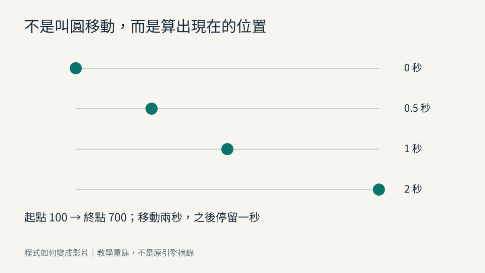

# 程式如何變成影片


不背術語，也能看懂 AI 如何用程式寫出一部電影


# 第 1 章｜影片為什麼不是一張會動的照片

## 前言：把驚嘆變成可以追問的理解

看見一羣亮點聚成文字，我們常先問哪個 AI 能做。本書把問題往前移：電腦需要哪些資料，才知道每個時刻該畫什麼？你不必先熟悉英文，但要能說出輸入、規則、結果與檢查方法。這些理解能帶著你換工具，而不必每次從名稱重新開始。

《當世界開始被計算》的畫面與報告是案例材料；完整原引擎程式碼未附在交接包中。本書例子都是教學重建。報告記載的工程旁白與歷史測試，會保留原來的證據範圍，不改寫為本輪正式配音或重新驗收。全書最後的小作品是你的遷移練習；預設範例跑得動，不等於你已完成自己的作品。

## 三秒鐘裡藏了兩種格子

把三張紙疊起來，每張都畫一顆圓，位置稍向右移。快速翻動時，你會看見位置連續改變。這個翻頁比喻只幫我們理解依時間顯示不同畫面；真正的播放器還會處理時間戳、壓縮與顯示，不一定把每張圖片獨立存成檔案。

先把一張畫放大。你看見的小色格是像素（Pixel）；一整張在某個時間顯示的畫面是影格（Frame）。二者不能互換。一張圖有很多像素，一支影片有很多影格。如果一個圓在每張畫的位置相同，即使影片有九十張，圓仍沒有位移。

畫面的寬與高決定解析度（Resolution）。960×540 表示每張畫面有 960 欄、540 列，共 518,400 個像素位置；這裡描述的是空間密度。每秒顯示多少影格則是幀率（Frames Per Second，FPS），描述時間密度。本書先採固定幀率，讓取樣時刻容易算；實際媒體也可能採可變幀率，不能只靠一個平均數還原所有時刻。

## 先算張數，再談流暢

三秒、每秒三十張，所需張數是 3×30=90。片長用秒，幀率用張／秒，相乘纔得到張數。當編號從零開始，九十張的索引是 0 到 89。[S01]

第 n 幀的取樣時間 t=n÷f；n 是影格索引，f 是每秒影格數，t 的單位是秒。第 0 幀是 0 秒；第 1 幀約 0.0333 秒；第 29 幀約 0.9667 秒；第 30 幀是 1 秒；第 89 幀約 2.9667 秒。最後一張在其後的時間區間繼續顯示到三秒邊界，所以最後取樣時間小於總片長。

把幀率改成每秒六十張，若規則仍按秒計算、片長仍為三秒，就要準備 180 張，移動不應加快。只有把原來九十張直接按每秒六十張播放，才會變成一點五秒。前者提高取樣密度，後者改變播放速度；它們是兩種不同操作。

圖解可以先在紙上畫兩條尺：上面一條標畫面寬度的像素位置，下面一條標時間 0、1、2、3 秒。在下方每秒劃三十個取樣點。不要把兩條尺合成一個「畫質」數字，因為提高空間細節和提高時間密度，成本與效果都不同。

## 顯示器不是影片的時間表

顯示器每秒更新多少次，是顯示器的另一項條件。影片可能只有每秒三十個取樣，而螢幕更新得更頻繁；同一影格可以在螢幕上維持多次更新。高更新率不會自動替影片補出真實的中間動作。觀感還受動作幅度、模糊、顯示節奏與觀看條件影響，因此本章不說某個幀率在所有場合都必然更好。

這裡最常見的錯誤，是把「每秒多畫一些」寫成「每幀多移動固定距離」。例如每幀移動十像素，三十幀會移三百像素；換成六十幀就移六百。修正的方法是先決定每秒的速度，再由影格時間算位置。下一章處理位置，第三章處理時間，第五章再處理快慢的形狀。

## 最小實驗與 AI 協作

配套 `examples/chapter_checks.py` 的第 1 項會列出上述五個時刻。於本書配套目錄執行 `python examples/chapter_checks.py --chapter 1`，預期輸出總張數 90、最後索引 89，以及 1÷30 和 89÷30 的秒數。它只用 Python 標準函式庫；若指令找不到檔案，先確認所在資料夾，不要為此安裝另一套動畫框架。

交給 AI 的指令可以是：「請建立三秒、960×540、30 fps 的教學動畫。所有動作按秒描述。列出總影格數、最後索引和第 0、1、29、30、89 幀的時間；改為 60 fps 後片長與同一秒的位置須不變。」驗收應比較相同秒數，而不是隻比較相同索引。

## 三題含答案

第一題：一張 640×360 的畫面有多少像素位置？答案是 230,400；這不是影片影格數。

第二題：四秒、25 fps，最後索引是多少？答案是 99；一共一百張，最後取樣是 3.96 秒。

第三題：三秒九十張改按 60 fps 播放，仍是三秒嗎？答案是一點五秒。若要保持三秒，必須按同一時間規則準備一百八十張。

## 來源與下一步

[S01] Remotion 官方〈The fundamentals〉，2026-10-05 核對：影格由零起算、最後索引為總張數減一、尺寸與幀率分別設定。https://www.remotion.dev/docs/the-fundamentals 。本章數字、翻頁比喻及練習為原創推導。接下來我們要讓「放在中間」成為不需要猜的資料。

## 術語回顧

像素（Pixel）：一張數位畫面中，用來記錄顏色的小格位置。

影格／單張畫面（Frame）：影片在一個指定時刻要顯示的整張圖。

每秒影格數／幀率（FPS）：說明影片時間每一秒包含多少張畫面。

解析度（Resolution）：本書主要指輸出畫面的寬、高各有多少像素。


# 第 2 章｜電腦怎麼知道白點在哪裡

## 「中間」需要一個共同約定

你請人把磁鐵放在白板中央，他會看白板邊緣，找出寬高的一半。電腦也需要這些邊界，還要知道你說的是磁鐵中心還是左上角。位置不只是兩個數字；少了起算點、方向或單位，同一組數字可能畫到完全不同的地方。

我們先約定一塊寬 960、高 540 的畫布（Canvas），左上角是原點（Origin）。橫向位置 x 往右增加，縱向位置 y 往下增加，單位是輸出畫面的像素。以一對有順序的數字描述位置，稱為座標（Coordinate）。本章採用的方向與常見二維 Canvas 約定一致，[S02] 但數學圖表或三維系統可能讓 y 向上；不能把此處方向當成所有工具的定律。

## 圓心與圓的邊緣不是同一位置

畫布幾何中心是 (480,270)。括號第一個數字為 x，第二個為 y；它不是大小。如果圓心在這裡，半徑 r=20，那麼左右邊緣分別到 460 和 500，上下邊緣到 250 和 290。這是一個連續幾何描述；真正著色的像素還要經過取樣與邊緣處理。

這個差別會在畫面邊緣暴露。如果把圓心設在 (0,0)，四分之三的圓超出畫布，而不是整顆圓都在左上角。如果你希望圓外緣距左邊與上邊各二十像素、半徑也是二十，圓心就應該是 (40,40)。計算是外緣距離二十，加上半徑二十，各軸都得到四十。

在紙上畫一個矩形，左上角標 (0,0)，右方向標 x、下方向標 y，再畫圓心和半徑。接著把原點移到紙中央，保持實體圓不動。你會發現數字改了、圖形卻沒移動。座標是描述的制度，不是物件本身；這就是地圖比喻的邊界。

## 用一組數字換畫布

若你要「在寬度四分之一處」，可以先存比例 0.25，而不把所有位置寫成固定像素。960 寬時 x=0.25×960=240；640 寬時 x=160。比例沒有單位，乘畫布寬纔得到像素位置。y=0.5×高度，則分別是 270 與 180。

這種相對位置有助於換尺寸，但不保證排版完成。圓若仍保持半徑 80，窄畫布可能顯得太大；中文標題也可能換行。所以位置、尺寸、留白要分別規定。把所有數字一律乘相同比例，是一個可用的方案，卻不是響應不同尺寸的唯一辦法。

另一個常見混淆是網頁顯示大小與真正輸出像素。網頁把影片縮到 480 寬，不會因此改掉原檔的 960 寬。若在瀏覽器座標與輸出座標之間取點，必須記錄換算關係。否則你在預覽上點中的位置，到了成片就可能偏移。

## 畫出來還有另一道工作

圓心與半徑是一個幾何規格。把這個規格轉成一格格顏色，是點陣化（Rasterization）的一部分；點陣圖（Raster image）儲存的是那些格子的結果。以路徑描述的 SVG 則可以保留幾何指令，再由顯示或輸出工具轉成像素。這裡不必先選誰更高階，先問哪份資料需要保留與重算。

本書配套的 `01_coordinate.svg` 同時標出座標軸、中心與圓的位置。SVG 檔可直接在瀏覽器看；只看這張示意不需要繪圖顯示卡。它的圖示是對座標約定的解釋，不是把網頁 Canvas、紙上座標與三維鏡頭混成同一套單位。

## 一個錯誤與最小檢查

錯誤要求是「圓放左上角二十像素」。這句可能指圓心，也可能指圓的外緣。修正後寫成「640×360 畫布，原點左上，y 向下，半徑二十，外緣距左與上各二十，因此圓心四十、四十」。規格長了一點，卻能直接驗收。

執行 `python examples/chapter_checks.py --chapter 2`，會檢查中心 (480,270)、外緣安全位置 (40,40)，並檢查半徑二十、圓心零零時確實越界。這是數值檢查，不宣稱圓緣的每個像素已在所有瀏覽器相同。AI 指令應再要求一張標座標的對照圖，讓你把計算和可見結果核在一起。

## 三題含答案

第一題：800×450 的幾何中心在哪？答案是 (400,225)。這個位置與圓的半徑無關。

第二題：半徑十五，外緣距右邊三十，畫布寬六百，圓心 x 是多少？答案是 600−30−15=555。

第三題：換到 y 向上的系統，原來的 (40,40) 是否還是左上附近？答案不一定；要先說明原點，再進行座標變換，不能只複製數值。

## 來源與下一步

[S02] MDN〈Drawing shapes with canvas〉，2026-10-05 核對座標原點、軸向及形狀繪製概念。https://developer.mozilla.org/en-US/docs/Web/API/Canvas_API/Tutorial/Drawing_shapes 。本章的留白、比例與邊界數字為教學推導。知道畫在哪之後，下一個問題是何時畫在那裡。

## 術語回顧

座標（Coordinate）：用數值說明位置，前提是先約定從哪裡量、往哪裡算。

原點（Origin）：座標量測的零點。

畫布（Canvas）：承載繪圖的區域；在網頁中也指特定繪圖元素。

點陣影像（Raster）：以規則排列的像素記錄畫面。


# 第 3 章｜如何把現在交給程式

## 電腦不用等影片中的四秒

你請程式畫第 120 幀，它花十分之一秒完成，或花十秒完成，都可以對應影片中的第四秒。這看似矛盾，其實因為我們用了兩種時間。一種是作品內部的位置，另一種是機器完成計算的耗時。離線製片的工作，是先算出要播的內容，不必以真正播放速度等待。

想像一本火車時刻表。你可以在上午就查晚上九點的位置，不必坐到晚上才能知道答案。這個比喻適用於規則已知的計算；如果位置依賴前面累積的狀態，你仍要重播或儲存前面的過程，不能憑一個時刻跳過所有原因。

## 「現在」成為一個輸入

本書把影片時間稱為時間參數（Time parameter）。把輸入按規則變成輸出的關係，稱為函式（Function）。例如輸入 t 秒，輸出圓心 x 像素，規則是 x=100+50×t；50 的單位是像素／秒。第零秒在 100，第二秒在 200，第四秒在 300。

固定幀率 f=30 時，第 n 幀使用 t=n÷30。第 45 幀就是 1.5 秒，位置 175。n 是無單位的索引，t 用秒；程式可以把 n 先換成 t，再讓所有場景共享秒這個尺度。這比在每個效果中各自寫「第幾張該做什麼」更容易改幀率。

圖解可畫兩條分開的時間線。影片線標 0、2、4 秒；運算線標機器開始與結束。用箭頭將「畫第 120 幀」連到影片的 4 秒，別把它連到運算線的 4 秒。渲染越慢，只延長等待成片的時間，不該把片中的圓拖慢。[S01]

## 打亂順序也要取得同一答案

試著依序要求第 60、0、30、60 幀。上面的規則應輸出 200、100、150、200。第二次要求第 60 幀，答案仍為 200。輸入、規則與相關環境固定時得到相同結果，稱為確定性（Deterministic）計算。

這個詞的適用範圍必須說清楚。數值位置相同，不代表不同字型、不同繪圖版本或不同編碼器輸出的影片檔案每個位元組都一樣。我們先要求狀態可重算，再按需要要求畫面相同；若要求整個 MP4 雜湊相同，還需要控制更多環境與封裝資訊。

也不是所有動畫都能用一句 x(t) 完成。球撞牆、點互相吸引，需要前一刻的速度和位置。這類模擬可以從相同初始狀態以固定步長重播到目標時間，或使用已驗證的快取。第十二章再說明。此刻重要的是選清楚：直接算答案，還是按固定路線重建答案。

## 兩個會悄悄破壞結果的輸入

第一個是機器的真實時鐘。程式若把開始後的耗時當作品時間，快電腦可能畫到第四秒，慢電腦卻畫到第六秒。同一影格因此出現不同位置。`sleep` 的等待也不能解決這個問題，它只是讓程式停一下；離線畫面應讀作品指定的時間。

第二個是未受控的亂數。假設每次畫第六十幀都重新抽圓的位置，那麼兩次結果不同，不是播放器問題，而是繪圖用了不同資料。Python 官方說明瞭亂數產生器的狀態與重現條件。[S04] 我們在第九章會先建立固定資料，再於每個時刻套用運動，避免每次重畫消耗不同序列。

## 最小驗證與協作指令

執行 `python examples/chapter_checks.py --chapter 3`，以打亂的索引驗證四次位置。此例直接計算位置，沒有睡眠、沒有真實時鐘，也沒有變動的外部服務。若第二次第六十幀不同，就先查固定輸入之外是否還讀取了全域變數。

你可以請 AI：「把影片時間作為明確輸入；同一幀可在任意順序重算。列出固定資料、環境及是否使用累積模擬。比較第 60、0、30、60 幀的狀態，第二次第六十幀須一致。不要用系統時間控制離線動作。」這個指令也適用於換工具，因為它描述的是行為。

## 三題含答案

第一題：輸出第 120 幀耗時十秒，片中一定過了十秒嗎？答案不是；30 fps 下它仍是影片第四秒。

第二題：規則 x=100+50t，第 45 幀在哪？答案為 t=1.5 秒、x=175 像素。

第三題：同一隨機種子就能保證任何電腦的 MP4 雜湊相同嗎？答案不能。還要區分亂數狀態、繪圖條件與編碼條件；本章測的是位置。

## 來源與下一步

[S01] Remotion〈The fundamentals〉，2026-10-05 核對按影格描述畫面的概念。https://www.remotion.dev/docs/the-fundamentals 。[S04] Python〈random〉，同日核對狀態與重現範圍。https://docs.python.org/3/library/random.html 。本章函式與測試順序為原創實驗。下一章將把起點和終點變成整條運動。

## 術語回顧

時間（Time）：本書主要指影片內經過幾秒，而不是目前時鐘時間。

函數／對應規則（Function）：給定輸入，按明確規則得到輸出。

可決定／同條件可重現（Deterministic）：在相同輸入及已約定條件下，結果能重做出來。


# 第 4 章｜圓點為什麼會動

本章配套為教學重建，不是原片程式碼摘錄。

本章承接前三章：我們已有一張畫布、知道怎麼指定位置，也知道影片的某個時刻可以換成一個數字。不必先會寫程式，先看一個圓為什麼可以「照我們的安排移動」。

## 我們不是命令它走，而是在決定每一張畫

想像你把一顆磁鐵放在白板上。你要它從左邊走到右邊，最自然的做法是用手推。電腦裡的圓卻不需要一隻看不見的手。

我們可以先做一件很樸素的事：準備幾張畫。第一張把圓畫在左邊，第二張往右一點，第三張再往右一點。依時間播放時，觀眾看見了位置的變化。

這個比喻有一個邊界。電腦不一定真的把每張圖存成獨立檔案；它可以在算好後，直接交給後面的影片輸出程式。此刻先關注「每一張應該畫在哪裡」，不要急著處理檔案怎麼壓縮。[S01]

所以我們先把問題改寫：

> 不是「如何叫圓自己往右走」，而是「當影片進行到某個時刻，圓心應該在哪裡」。

這個轉換很重要。前一句像在指揮一個有意志的角色，後一句則是一個可以計算、可以檢查的問題。

## 先把要求說到不需要猜

這次畫面寬 800、高 450。圓的半徑是 18，圓心上下位置一直固定在 225。我們只改左右位置，讓圓心從 100 移到 700，花兩秒完成。整段影片仍有三秒，所以它到達後會留在終點一秒。

這些數字有各自的工作。100 與 700 告訴我們從哪裡走到哪裡；兩秒告訴我們花多久；第三秒的停留則讓觀眾看清楚結果。沒有說停留，AI 可能繼續移動，也可能馬上切幕，那都不是我們明確安排的版本。

圓的位置、尺寸或顏色，都是它可以被描述的特徵。程式裡常把這些特徵稱為**屬性（Property）**。這次選中的屬性是左右位置。

而「移動兩秒」「起點 100」這些交給計算規則使用的設定，可以稱為**參數（Parameter）**。先不用背這兩個字，知道我們不是修改「整個圓」，而是修改一項設定，就夠了。

## 用一把尺算中間的位置

從 100 到 700，一共相差 600。

如果兩秒走完，而且每一段時間走得一樣快，那麼經過一秒，就是走完一半。600 的一半是 300，再加上起點 100，現在的位置就是 400。

再試一次：經過半秒呢？半秒是兩秒的四分之一，所以走完 600 的四分之一，也就是 150。加上起點，圓心就在 250。

| 已經過的時間 | 走完整段的比例 | 圓心左右位置 |
|---|---|---|
| 0 秒 | 0 | 100 |
| 0.5 秒 | 四分之一 | 250 |
| 1 秒 | 二分之一 | 400 |
| 1.5 秒 | 四分之三 | 550 |
| 2 秒 | 全部 | 700 |
| 2 秒之後 | 已經完成，保持不變 | 700 |

這裡的比例叫**完成進度（Progress）**。還沒開始是 0，全部完成是 1。它沒有像素或秒的單位，也不是速度。速度會說「每秒移動多少像素」；進度只回答「到這個時刻，完成多少比例」。



圖中的直尺為排版向右平移 50 像素；文字中的 100、250、400、700 始終是教學座標。排版平移不會改變這四個位置之間的差距。

## 公式只是把剛纔算的事寫短一點

現在才把剛才的計算整理成一行：

```text
現在的位置 = 起點 +（終點 − 起點）× 完成進度
```

先不用英文。這句話可以直接念出來：「從起點出發，再加上全程的一部分」。我們剛才已經用這個方法算了兩次。

把它寫成比較短的符號，就變成：

```text
p = a + (b - a) × u
```

其中 a 是起點，b 是終點，p 是目前位置，三者單位都是像素。u 是剛才那個零到一的進度，沒有單位。

當 a=100、b=700、u=0.25 時，就是：

```text
p = 100 + (700 - 100) × 0.25
  = 100 + 600 × 0.25
  = 250
```

已知起點與終點，再按規則算出中間的值，這類方法叫**插值（Interpolation）**。這裡用的是最簡單的線性插值。它只是在替你已經會做的計算取名字，不是又要求你先懂另一套神祕技術。

往後看到程式裡的 `lerp`，常是在縮寫「線性插值」。本章配套函式就叫這個名字；但你真正要檢查的仍是輸入與結果，不是拼字。

## 時間怎麼變成進度

還有一個問題沒有處理：程式怎麼知道現在是四分之一？

本例從影片零秒開始，移動時間是兩秒，所以在還沒結束前：

```text
時間進度 = 已經過的秒數 ÷ 移動需要的秒數
```

半秒除以兩秒，就是 0.25。這裡秒除以秒，單位抵消，纔得到沒有單位的比例。

接下來要處理結束之後。到了第三秒，直接用 3÷2 會得到 1.5。若把 1.5 填入位置公式，圓會繼續走到 1000，早就跑出原先的終點。

這不是計算機算錯，而是我們漏寫規則。我們原本要求兩秒後停住，就應該把進度上限限定為 1。開始以前也不讓它低於 0。這種邊界處理不是裝飾；它正是「看起來能動」與「照規格動」的差別。

## 看一段真正能執行的程式

以下是 Python 程式，不是偽程式。你可以先逐行對照中文，稍後再執行配套檔案。

```python
start_x = 100       # 起點，單位是像素
end_x = 700         # 終點，單位是像素
duration = 2.0      # 移動所需秒數，必須大於零
time_seconds = 0.5 # 目前的影片時間，單位是秒

progress = time_seconds / duration
progress = max(0.0, min(1.0, progress))
current_x = start_x + (end_x - start_x) * progress
print(current_x)    # 250.0
```

`min(1.0, progress)` 的意思是：在 1 與計算出的進度之間，取較小的一個。因此進度不會大於 1。外面的 `max(0.0, ...)` 則再取不小於零的結果。兩個規則合起來，把進度限制在零到一。

程式裡的 `=` 是把右邊結果存進左邊名稱，不是在宣告永遠成立的數學等式。所以 `progress` 可以先存計算出的 1.5，下一行再被更新成 1。

這段程式只有算位置，還沒有把圓畫出來。這個區分也要保留：**先算狀態，再畫狀態，是兩份不同的工作。**

本包的 `examples/motion_core.py` 寫了相同原理，並補上時間不得是無限大、移動時間必須大於零等檢查。`examples/build_examples.py` 才把結果畫成 SVG 圖。

在交接資料夾裡執行：

```sh
python examples/build_examples.py
```

這句是請 Python 執行 `examples` 子資料夾裡的 `build_examples.py`。完成後開啟 `examples/output/02_interpolation.svg`，就能看到剛才的四個時點。看已附的圖不需要安裝任何新的套件；重建這些 SVG 只需要 Python 標準函式庫。

## 同一秒鐘不必只算一次

我們採 30 fps，也就是影片每秒安排 30 張畫面。在固定幀率的例子裡，第 n 張畫面的時間是 n÷30。編號從 0 開始，所以第 15 幀是 0.5 秒，第 30 幀是 1 秒，第 60 幀是 2 秒。[S01]

三秒影片共 90 幀，編號是 0 到 89，不是 1 到 90。最後一張的取樣時間是 89÷30，約 2.967 秒。它仍然在兩秒之後，所以圓心保持 700。

這也解釋了為什麼「最後取樣時刻」與「片段總長度」不完全相同。最後一張畫面還要顯示到三秒邊界，不需要額外多算第 90 幀，才叫三秒影片。

## 讓 AI 幫忙，但不要讓它偷換問題

現在可以這樣交代 AI：

> 做一段三秒、30 fps 的動畫，畫面 800×450。半徑 18 的圓保持 y=225，x 從 100 線性移動到 700，移動花兩秒，最後一秒停在終點。位置由影片時間直接計算，不使用真實時鐘或等待。請列出第 0、15、30、60、89 幀的位置，並確認重畫第 30 幀得到相同結果。

這段指令不必堆砌大量英文，卻已經交代起終點、時間、速度方式、停留和驗收。即使換一個模型，這些要求仍能被理解與檢查。

本章不要求 AI 一定使用某個框架。只要它真的按這些條件產出，你就知道它做的是同一件事；若它擅自增加彈跳、改成五秒，或用另一張圖遮住錯誤，你也有依據指出來。

## 三個問題，確認自己真的懂了

**第一題：用中文教人。** 圓為什麼看起來會動？

參考答案：程式在不同影片時刻計算不同位置，再把圓畫到相應位置。依時間顯示這些畫面，就呈現位置變化。不是因為「圓這個物件知道自己要走」。

**第二題：只改一個參數。** 起終點不變，把移動時間改為四秒。經過半秒，圓在哪裡？

參考答案：半秒除以四秒是 0.125；600×0.125=75；加起點 100，得到 175。提醒：三秒原片長不足以容納四秒移動加一秒停留，完整作品規格也要延長，不能只改局部參數就聲稱需求仍全滿足。

**第三題：找錯。** 有人說：「三秒影片最後一幀是第 90 幀，所以要從 0 畫到 90。」哪裡不對？

參考答案：從 0 到 90 共 91 張。在本例 30 fps、三秒的設定下，只需要編號 0 到 89 共 90 張；另加第 90 幀就超出原本片段。

## 下一個問題：位置對了，為什麼仍像機器

你現在已經可以按時間算位置，也能看出超過終點和多算一幀的錯誤。不過，每段時間走一樣遠，有時會顯得生硬。

下一章不改起點，也不改終點。我們只改「進度怎麼隨時間增加」。先觀察慢起步與慢停下的差異，再認識工程師為這件事取的名字。

## 本章來源與重建方式

[S01] Remotion 官方，The fundamentals。查覈日期 2026-10-05。https://www.remotion.dev/docs/the-fundamentals 。引用範圍：按幀與時間描述畫面、固定幀率及從零起算的基本觀念；本章數字、比喻、程式與練習為本包原創推導。

可重建圖：`examples/output/02_interpolation.svg`；原理程式：`examples/motion_core.py`；測試：`tests/test_motion_core.py`。本章不是原片原始碼的逐行解說。

## 術語回顧

屬性（Property）：某個物件具有、可以描述或改變的特徵。

參數（Parameter）：交給一個規則或工具的設定值。

完成進度（Progress）：從開始到結束，目前走完多少比例。

插值（Interpolation）：已知幾個值，按選定方法求它們之間的值。


# 第 5 章｜為什麼等速看起來像機器

## 相同的路，走法可以不同

把杯子推向桌面另一邊，人通常不會在開始那一瞬間直接達到全速，再於終點瞬間停止。你會先加快，再放慢。但電腦按第四章的線性位置規則，會讓每段等長時間走一樣遠。這不是錯誤，只是它忠實完成了等速要求；若想要另一種感覺，必須改規則。

杯子的比喻只幫我們觀察快慢。動畫中「感覺有重量」不一定表示真的模擬質量、摩擦或肌肉。你也可以用一條事先設計的曲線安排節奏，而不用做完整物理運算。適合圖解的運動，未必需要像真實物體。

## 先改進度，後算位置

第四章把時間換成 u，範圍從零到一，再用起終點算位置。現在在兩步之間插入一個轉換：把時間進度 u 換成新的運動進度 e。這種時間進度的重新對映稱為緩動（Easing）。插值仍負責把 e 變成位置；緩動和插值的輸入輸出不同。[S16]

本章選 e=u²(3−2u)，並把 u 限在零到一。u 與 e 都沒有單位；它們不是像素，也不是速度。這條曲線起終點的斜率為零，中段變化較快，是一種慢起步、慢停下的方案。其他緩動可以只慢起步、分段跳動、超過終點再返回；不能把本例當作緩動的全部定義。

起點 a=100、終點 b=700，位置 p=100+600e，單位是像素。花兩秒移動時，半秒得到 u=0.25；e=0.25²×(3−0.5)=0.15625；p=193.75。等速在同時刻是 250，緩動的圓還沒有走那麼遠。

到一秒，u=0.5，e=0.5，二者都在 400。到一點五秒，u=0.75，e=0.84375，位置是 606.25，已超前等速的 550。最後二秒都到 700。這三個對照告訴我們：只看中點，完全可能看不出節奏差異。

## 曲線的斜率不是路徑的彎曲

圖解應畫兩組東西。上方畫同一條直線上的圓，下方畫橫軸時間進度、縱軸運動進度的曲線。圓走的路仍是直線；彎的是時間到進度的關係。把彎曲的進度圖誤認為彎曲路徑，會讓 AI 在不該轉彎時畫出弧線。

速度（Velocity）描述位置隨時間變得多快，本例可用像素／秒表示。加速度（Acceleration）描述速度隨時間的變化，可用像素／秒²表示。即使不會微分，你也能把相鄰時點的位置差除以時間差，估計那一小段的平均速度；只是不能把平均值說成整段每個瞬間都相同。

總距離六百像素、總時間兩秒，平均速度仍為三百像素／秒。緩動改的是這三百如何分配在各時刻，不是改了總距離。把時間改為四秒，曲線形狀相同但展開得更慢，平均速度變成一百五十。

## 一個會讓效果失真的錯誤

有人把 e 直接當每幀增加的位置，例如每幀 x+=600e。越到後面增加越多，最後遠遠超過 700。修正是每次從固定起點算 p=a+(b−a)e；這是取得現在的位置，不是累加一份位移。

另一個問題是對每個物件都套同一曲線。標題進場、數值變化與警告閃爍的目的不同。把資料更新做成超出目標的回彈，觀眾可能把過衝誤認為資料值。先說明動畫代表什麼，再選節奏；好看不該抹掉語意。

## 最小實驗與驗收

執行 `python examples/chapter_checks.py --chapter 5`，檢查零、四分之一、二分之一、四分之三和終點。配套 `03_easing.svg` 可對照曲線；八秒示範短片前半段呈現等速與本例緩動。這些是本書的教學重建，沒有證明原案例採同一條曲線。

AI 指令：「起終點與兩秒時間保持相同，上方等速、下方用 u²(3−2u)。列出 0.5、1、1.5 秒的兩種位置。不要把 e 累加到上一幀；畫面要能直接按任意時間重算。」先核數字，再看首尾是否生硬，最後才判斷這個節奏是否適合敘事。

## 三題含答案

第一題：插值和緩動各做什麼？答案：前者按比例求起終點之間的值；後者改變時間比例如何變成運動比例。

第二題：u=0.25，本例已完成多少路程？答案 0.15625，即 15.625%，不是 25%。

第三題：只截一秒的中點能證明兩種動作不同嗎？答案不能；此例兩者中點都是 400，要加看前後時點。

## 來源與下一步

[S16] CSS Working Group〈CSS Easing Functions Module Level 2〉，2026-10-05 核對時間進度對映與型別；引用的是草案概念，本文不依賴其未定 API。https://drafts.csswg.org/css-easing/ 。多項效果共享時間之後，我們還需要一個方法讓它們不互相打架。

## 術語回顧

緩動／進度變化規則（Easing）：決定動畫一開始、中間、結尾各走得多快。

速度向量（Velocity）：位置隨時間改變的方向與快慢。

加速度（Acceleration）：速度隨時間改變的快慢。


# 第 6 章｜好幾件事如何同時發生

## 一段片子不只有一顆圓

想像第一幕先出標題，半秒後圓開始移動，三秒時切第二幕。若每個效果都自行記「現在過了多久」，場景重畫和切換就很容易出錯。需要的不是更多等待，而是一張共同的安排表：全片到什麼時間，哪個單位應該啟用，它內部又過了多久。

舞臺節目表是有用的比喻。整晚有共同時程，每個節目也有自己的起點。但電腦的場景不一定像劇團有真實物件；它可以是資料記錄、函式或節點集合。所謂物件（Object）在本書只是可被描述與操作的單位，不規定你必須用哪種程式語言風格。

## 全片時間與本幕時間

把一段內容組成可安排的單位，稱為場景（Scene）；記錄其開始與長度的安排，稱為時間軸（Timeline）。第一幕從 0 到 3 秒，第二幕從 3 到 6 秒。當全片 t=4.2，第二幕局部時間 τ=t−3=1.2 秒。τ 的單位也是秒，只是起算點不同。

這樣第二幕的標題若安排在「本幕半秒後」，它就於全片 3.5 秒開始。改把第二幕移到全片第十秒，標題會跟著移到 10.5 秒，不必修改幕內每項效果。局部時間（Local time）讓內容能搬動，卻仍以同一全片時間驗收。

圖解可以把全片線畫在上方，兩條局部線放下方。第一條標 0 到 3；第二條從全片 3 的位置重新標零。當箭頭落在全片 4.2，下方第二條顯示 1.2。不要在同一條尺上忽然換起算點卻不標示，這正是很多時序錯誤的來源。

## 邊界必須只屬於一幕

若第一幕用「0≤t≤3」，第二幕用「3≤t≤6」，第三秒會同時符合兩幕。沒有定義合成順序時，畫面可能被不確定地覆蓋。最小方案是半開區間：第一幕 [0,3)，第二幕 [3,6)。左端包含、右端不包含，第三秒只啟用第二幕。

六秒是全片結束邊界，不屬於這兩幕。30 fps、六秒共一百八十張，最後取樣 179÷30 約 5.9667 秒，仍在第二幕。這個規則與第一章的末幀原則一致，而不是靠「最後再多畫一張」修補。

若要轉場，你可以明確讓兩幕重疊半秒；但要另說如何混合、誰在上方、透明度如何變。重疊是設計，不是含糊的端點。不同框架提供不同編排方式，[S05][S14] 本書先保留可檢查的時間契約。

## 成組不只是一起出現

假設標題和圓形成一組，你把整組向右移五十像素。圓局部 x=100，組的位置 x=50，畫面 x 就是 150。在只有平移的例子，直接相加成立；有旋轉、縮放及多層父子關係時，變換順序就影響結果。幾何變換（Transform）指這些位置與形狀的規則，並不代表一定使用完整三維引擎。

先畫父框、框中的圓，再在畫布上畫合成位置。這一張圖讓讀者分清組的移動與圓的局部運動。若 AI把父位置加了兩次，整組會多移五十；如果它先換成全域座標又再套父變換，同樣會重複。

## 最小檢查與 AI 指令

執行 `python examples/chapter_checks.py --chapter 6`，確認第三秒只選第二幕、局部時間為零，六秒返回無場景，4.2 秒取得 1.2。配套會拒絕時間空洞及重複 ID，而不是默默補一段空白。

AI 指令：「兩幕各三秒，採左含右不含區間。第二幕的所有效果使用局部時間；檢查全片 2.999、3、4.2、6 秒。若需要轉場，另列重疊區間與混合規則，不改掉原本無重疊模式。」這使你能看到邊界，而不只看到一段順利播放的中間。

## 三題含答案

第一題：第二幕從五秒開始，全片六點五秒，本幕過了多久？答案一點五秒。

第二題：[0,3) 與 [3,6) 在第三秒啟用哪幕？答案第二幕，第一幕已結束。

第三題：組向右五十，圓在組內 x=100，只有平移時在哪？答案 150。若有縮放旋轉，要先核對順序，不能任意相加。

## 來源與下一步

[S05] Manim 官方〈A deep dive into Manim's internals〉，2026-10-05 核對場景及動畫分工。https://docs.manim.community/en/stable/guides/deep_dive.html 。[S14] Motion Canvas〈Animation flow〉，同日核對同時與順序編排的框架例子。https://motioncanvas.io/docs/flow/ 。本章半開區間與數值安排為本書教學契約。下一章把「何時出現」用在一條完整的線上。

## 術語回顧

物件（Object）：把一個可描述、可操作的元素當成單位。

場景（Scene）：在作品中一起安排的一組畫面與事件。

時間軸（Timeline）：安排事件何時開始、結束與交疊的結構。

局部時間（Local Time）：從目前場景或片段開始算的時間。

幾何變換（Transform）：改變位置、方向、尺寸或座標參考的運算。


# 第 7 章｜線條怎麼自己長出來

## 先有整條線，再決定露出多少

看到一條路線從起點向前延伸，容易以為程式正像鉛筆那樣逐步留下墨水。這是一種做法，但還有另一種：先備好完整線形，再按時間控制可見範圍。前者累積畫過的痕跡，後者可以隨時重算任意時刻的畫面。

拉開窗簾是近似的比喻；簾後內容先存在，你只改露出的區域。邊界在於，曲線揭露常沿著路徑走，不一定像矩形窗簾從左到右。遮住未到達的部分能做出「長出來」的觀感，卻不能因此宣稱模擬了植物生長或手寫壓力。

## 三個點如何決定一條彎線

路徑（Path）描述沿哪些位置連線成形；描邊（Stroke）則把線形畫出寬度與顏色。用起點 A、終點 B 和一個控制點 C，可以定義二次貝茲曲線（Quadratic Bézier curve）。控制點牽引彎曲方向，但曲線一般不必穿過它。[S03]

先用兩次直線插值理解它。從 A 到 C 按比例 u 找 P；從 C 到 B 按同一比例找 Q；再從 P 到 Q 按 u 找 R。當 u 由零走到一，R 就畫出曲線。這個流程用的是已學的插值，不需要把未知名詞套在另一個未知名詞上。

本例 A=(0,0)、C=(50,100)、B=(100,0)，座標單位為像素，y 向下。u=0.5 時，P=(25,50)、Q=(75,50)，R=(50,50)。曲線中點並不是控制點 (50,100)。控制點在紙上用空心圓、控制線用虛線，實際曲線用實線，這樣就不會把三者混在一起。

合在一行的公式是 R=(1−u)²A+2(1−u)uC+u²B。每個係數沒有單位，A、C、B 用像素，R 仍用像素；x 和 y 分別按同一公式計算。u=0 時只留下 A，u=1 時只留下 B，端點檢查因此很直接。

## 四分之一進度不是四分之一路長

在 u=0.25，R=(25,37.5)；u=0.5 得 (50,50)；u=0.75 得 (75,37.5)。前三個區間的參數增量相同，但兩點間的距離不同。第一段從 (0,0) 到 (25,37.5) 約 45.07 像素；下一段到 (50,50) 約 27.95。均勻增加 u，不能直接保證沿路等速。

若只是逐步展示一條概念線，這可能已經足夠。如果你要一顆點等速沿路移動，就要估計各段弧長，把累積距離與 u 建成對照，再依想走的距離反查 u。取樣太疏會低估彎曲路長，反查也有誤差；增加取樣並比較結果，比一句「使用貝茲所以很自然」可靠。

這個區分也說明緩動放在哪：先用時間得到想走的路程比例，再由路程查曲線參數，最後求位置。如果直接對 u 加緩動，得到的是「參數節奏」，不一定是你心中的「路程節奏」。

## 找錯與最小驗證

常見錯誤是拿控制點當曲線中點，或把揭露 50% 說成一定走完一半弧長。修正時先列出定義，再要求三個數值對照。配套 `04_path.svg` 展示控制點與取樣；執行 `python examples/chapter_checks.py --chapter 7`，會驗證端點、中點和四分之一點。

AI 指令：「以 A、C、B 的數值建立曲線，顯示 u=0、0.25、0.5、0.75、1 的點。控制點與曲線用不同樣式；文字明寫參數進度不等於弧長進度。若要求等速，再提供距離反查的誤差比較。」先把何種進度說清楚，纔有適合的圖。

## 三題含答案

第一題：本例 u=0.5 時曲線經過 C 嗎？答案沒有，R=(50,50)，C=(50,100)。

第二題：均勻增加 u 必然等速嗎？答案不一定，因為各段弧長不同。

第三題：線形揭露能證明原片真的累積繪圖嗎？答案不能；相似畫面可以來自遮罩、裁切或重算，必須讀原碼才能確認。

## 來源與下一步

[S03] MDN〈Paths〉，2026-10-05 由舊路徑轉址後核對貝茲曲線和控制點概念。https://developer.mozilla.org/en-US/docs/Web/SVG/Tutorial/Paths 。公式及本例數字為自行推導。能畫線之後，我們再看為什麼中文字比畫線多幾道工作。

## 術語回顧

繪圖路徑（Path）：用直線、曲線等規則描述的一條走法或輪廓。

貝茲曲線（Bezier Curve）：由端點與控制點按特定規則決定的平滑曲線。

控制點（Control Point）：用來決定曲線形狀的參考位置。

描邊／筆畫（Stroke）：沿幾何路徑畫出的線，具有寬度與端點樣式。


# 第 8 章｜中文字為什麼比畫圓麻煩

## 字串正確，畫面仍可能錯

畫圓只需中心和半徑；畫「計算」還要知道字長什麼樣、如何排列、佔多少空間。你在程式裡看見正確文字，輸出卻出現方框，問題可能不在文字內容，而是選定字型沒有那個字。這兩層若混在一起，就會不停修改原文，卻始終無法修好畫面。

活字印刷可以幫我們想像字形的選擇，但數位文字不一定一個符號配一塊字模。多個編碼可能組成一個使用者看見的字，一段文字也可能經過連字或不同位置調整。比喻只到「內容需要轉成可畫的形狀」為止。

## 從文字內容走到形狀

文字使用的樣式與字形集合稱為字型（Font）；某個具體可畫的形狀稱為字形（Glyph）。同一個「計」在不同字型中寬度、筆畫與重心可能不同。把字串轉成合適字形並安排位置，是文字塑形的一部分。HarfBuzz 官方檔案說明瞭這份分工，[S11] 但知道這個名稱不表示你要立即安裝該工具。

再往上看，一個人眼感覺是一個字的單位，未必只佔一個編碼。例如字母加結合重音，或由多部分組成的表情符號。Unicode 的字素叢集分段提供相應規則。[S15] 所以逐字動畫不應隨意按儲存單位切開，否則同一個可見字可能被拆成不完整的片段。

本章先採中文「計算」兩個一般字，容易檢查。遇到混合語言、表情或結合符號，再要求所用工具按感知字元分段。簡化是縮小測試範圍，不是宣稱所有字都只有一個程式碼。

## 置中要量實際畫出的範圍

字框（Bounding box）是包住實際形狀的範圍；基線（Baseline）是排列文字時用來對齊的參考線。字框不一定從原點開始，字型有自己的留白；上下置中與基線對齊也不是同一件事。

假設量得字框左=2、上=5、右=102、下=45，實際寬為一百、高為四十。想讓它在 400×200 畫布中央，繪字原點應設 x=200−(2+102)÷2=148，y=100−(5+45)÷2=75。重新加回字框偏移後，可見範圍為 x=150 到 250、y=80 到 120，其中心正是 (200,100)。這是一組假設量測值，用來說明計算，不是假稱某字型必然有這個字框。

圖解先畫畫布中心十字，再畫字框與基線。若文字視覺重心仍顯得偏，可能要做光學調整；它應另有說明，而不是悄悄把數學置中改掉。記下測量值與調整值，日後換字型就能重新核對。

## 逐字出現也要保留版面

若每次只畫目前可見的字，再把短字串重新置中，標題會一邊出字一邊跳動。修正方法是先按完整標題排版，保留所有字的位置，再逐字改透明度。不透明度從零到一描述可見程度，不改變字形位置。

兩字標題若「計」從 0 到 0.3 秒淡入，「算」從 0.2 到 0.5 秒淡入，第二字只是在局部時間上錯開 0.2 秒；無須重新量另一份短字串。這是第六章時間軸的延伸。

缺字時可以換合法可用的字型或明確的替代字型，但要讀回實際結果。不把看似像中文的亂碼當成功。配套不附字型檔，使用本機已有字型；使用權及散佈權不同，不能因為本機能用就打包分享。

## 最小驗證與 AI 指令

執行 `python examples/chapter_checks.py --chapter 8`，檢查上述字框置中數字。這項標準函式庫檢查只驗證幾何，不驗證字型真的覆蓋所有文字。配套短片用本機中文字型重建時，再看標題與字幕是否缺字。

AI 指令：「先量完整『計算 AI 2026』的實際字框與基線，再安排逐字透明度。請測中文、英數及一個結合符號；不拆壞感知字元，不重新置中已出現的短字串。列出實際字型，不附字型檔。」

## 三題含答案

第一題：字串正確但出現方框，優先查什麼？答案是實際選用字型及缺字替代，而不是立即改文字。

第二題：上述字框在 400×200 中置中，原點在哪？答案 (148,75)。

第三題：一個表情看似一字，儲存時必然只有一個碼嗎？答案不一定；要區分編碼、感知字元與字形。

## 來源與下一步

[S11] HarfBuzz〈What is HarfBuzz?〉，2026-10-05 核對字串到字形與位置的分工。https://harfbuzz.github.io/what-is-harfbuzz.html 。[S15] Unicode UAX #29〈Text Segmentation〉，同日核對字素叢集概念。https://www.unicode.org/reports/tr29/ 。接下來把單個物件擴展成一羣資料。

## 術語回顧

文字排印（Typography）：安排文字的字形、大小、間距與版面層級。

字形（Glyph）：文字被畫出時實際使用的形狀。

字型（Font）：提供文字形狀與相關排版資訊的資源。

外框／包圍盒（Bounding Box）：用矩形包住某個圖形或文字的範圍。

文字基線／基準線（Baseline）：排文字時用來對齊的一條參考線。


# 第 9 章｜一千顆小點怎麼一起管理

## 點數多，不代表規則也要多

假設一百人依座位表入座，你不必替每個人寫一套走路原理；需要的是每個人的資料與共同規則。動畫中的一千顆點也可以這樣。每顆記起點、速度、顏色或目標，程式逐筆讀取，再用同一方法計算當前位置。

座位表比喻不包括人的自主決定。本章的小點沒有意志，也不必模擬碰撞或重力。它們只是畫面中的資料單位，稱為粒子（Particle）；一組粒子與其更新、顯示規則組成粒子系統（Particle system）。名稱裡有粒子，不代表它就是真實物理。

## 一列資料承擔一份差異

把多筆資料依順序存成集合，稱為陣列（Array）；Python 例子也可用串列或固定序列承載。關鍵是穩定地知道第 i 筆屬於哪顆，而不是拘泥於語言名稱。前三筆可記為「編號 0，起點 10，速度 20」；「編號 1，起點 50，速度 −10」；「編號 2，起點 90，速度 0」。起點是像素，速度是像素／秒。

規則 x(t)=起點+速度×t。第兩秒，三顆分別在 50、30、90。負速度代表往約定的負方向移動，不是錯值；零速度則原地停留。圖解把這三列資料畫在左邊、三個點畫在右邊，用編號連線，顯示共同規則如何產生不同結果。

真的擴到二百或一千顆時，仍只有一套規則。成本主要增加在逐筆計算、繪圖、合成及資料量，不代表每顆都需要一個複雜程式物件。若點數增大讓渲染變慢，先量時間，再判斷瓶頸，不能直接歸因於沒有使用某張顯示卡。

## 亂數應該成為固定資料

我們想讓點的起點分散，可以用偽隨機產生器生成資料。給產生器的初始設定稱為種子（Seed）；它幫助固定起始序列。Python 的 random 檔案說明其重現條件及狀態機制。[S04]

可靠的順序是：建立本書示範的局部亂數產生器，抽出兩百組起點，儲存；每次畫某一時刻，只讀那些起點。不要每一幀重新抽完整起點。後者會讓點瞬間跳動，連畫同一幀兩次也可能不一致。

相同種子還不足以保證所有結果。先抽顏色再抽位置，與先抽位置再抽顏色，會消耗不同位置的亂數；演算法與環境變化也可能影響結果。把種子、呼叫順序、生成資料與相關版本記錄下來，比只記錄一個幸運數字完整。

## 散佈不是排序

如果二百顆點沒有穩定編號，後續要讓每顆走到特定目標就很難追蹤。你可以選擇按陣列索引配對，但必須維持順序。如果每幀都按當前 x 排序，再按索引分配目標，同一顆點可能突然換目標。視覺上像抖動，根因卻是身份變了。

粒子資料因此至少要區分身份、初始條件與當前狀態。固定初始資料按時間直接算出的狀態可以亂序重畫；依賴累積力的狀態則要重播。第十二章會再比較，不把「很多點」與「狀態模擬」自動劃上等號。

## 最小驗證與協作

執行 `python examples/chapter_checks.py --chapter 9`，會用局部產生器建二百點、檢查落在指定範圍，重建時比較同一資料，並驗證不消耗全域序列。配套 `05_particles.svg` 是可見對照，但單張圖不能證明全程沒有跳點，要加看相鄰時刻。

AI 指令：「固定二百顆粒子的編號和起點，記錄種子與生成順序。當前位置只由固定資料與影片時間計算。比較同一幀兩次；不要把隨機起點寫在每幀更新內。此例不含物理碰撞，必須明確說明。」

## 三題含答案

第一題：一千點是否需要一千段不同程式？答案不需要，一千列資料可共享一套規則。

第二題：起點五十、速度負十，兩秒在哪？答案三十像素。

第三題：種子相同但先抽顏色與先抽位置不同，位置必然一樣嗎？答案不保證，因為序列消耗順序改變。

## 來源與下一步

[S04] Python〈random〉，2026-10-05 核對局部產生器、狀態與重現範圍。https://docs.python.org/3/library/random.html 。數字與資料表示為本書教學。下一章為每顆點安排明確終點。

## 術語回顧

陣列（Array）：依順序裝著一組資料的容器。

粒子（Particle）：一個按規則顯示與變化的小元素。

粒子系統（Particle System）：管理許多粒子的資料、行為與繪圖方式。

亂數種子（Seed）：用來初始化某種偽亂數序列的設定值。


# 第 10 章｜散點怎麼排成一個字

## 小點並不知道「字」是什麼

畫面中點從四處飛來，最後排列成「井」，很容易被說成點懂得組合文字。更可檢查的描述是：我們先取得一組目標位置，再為每顆點決定去哪裡。字的含義由人提供，程式處理的是幾何和對應關係。

排隊入座的比喻幫助理解分配，但點沒有人類對目的地的判斷。你必須先寫分配規則；如果目標不夠、太多或距離很遠，程式不會自動替你做合理選擇。動畫看起來連貫，不代表分配已經最好。

## 先做形狀，再抽位置

遮罩（Mask）告訴我們哪些區域屬於形狀、哪些不屬於。它可以有隻有內外兩種值的版本，也可以有漸變。本例不讀字型，直接用四條矩形筆畫畫出「井」形。必須註明它是教學幾何，並不是通用中文字轉換器。

在一個網格中檢查位置是否落在筆畫內，再留下那些位置，這叫取樣（Sampling）。留下的位置就是目標（Target）。例如本書遮罩有兩條直筆畫、兩條橫筆畫；每隔十像素看一個位置，落在四條筆畫任意一條就留下。相交處只留一次，不能重複產生同一點卻不記錄。

網格間隔越小通常產生更多點，形狀也較密；實際數目還取決於邊界是否包含、筆畫寬度和格點起始位置。所以不要憑「隔十像素」猜點數，先跑取樣函式並讀回長度。點很少時，字可能只剩幾個暗示；加光暈不能代替補足形狀。

## 對應規則決定每顆的道路

把起點與目標建立關係，稱為對映（Mapping）。最小辦法按相同索引配對：起點 0 對目標 0，起點 1 對目標 1。它好理解、容易重現，可能卻會產生大量交叉，不應稱為最短路線。

拿三顆演算。起點 S0=(0,0)、S1=(20,0)、S2=(40,0)，目標 T0=(10,30)、T1=(20,30)、T2=(30,30)。進度 u=0.5 時，分別是 (5,15)、(20,15)、(35,15)。單位都是像素；我們只做直線插值。若使用第五章的緩動，先將時間進度對映為 e，再在兩點間求值。

圖解從左到右排四格：筆畫遮罩、取樣點、編號配對線、完成位置。配對線交叉很多並不證明程式錯了，卻告訴你運動可能顯得雜亂。若想減少交叉，可研究近鄰或整體分配，但還要比較計算成本、身份穩定和結果；不要把新名稱當成自動提升品質。

## 五百顆與三百目標怎麼辦

數量不同必須先決定政策。你可以增加取樣密度，減少粒子，或讓多個粒子共享目標。每個政策都改變視覺結果。若五百顆共享三百點，有兩百份額外分配，部分位置會更亮；這不是暗中可以忽略的細節。

常見錯誤是迴圈五百次卻讀取只有三百項的目標陣列。好的程式應在產生動畫前拒絕長度不合的資料，或執行明確政策。不能因為後面加了模糊，看不見缺失，就說全部點已正確成字。

## 最小實驗與驗收

執行 `python examples/chapter_checks.py --chapter 10`，檢查幾何遮罩目標無重複，起終點數量相同，零進度等於起點、完成進度等於目標；再以亂序時間重算。配套短片後半段就是這份教學重建，不是原影片粒子數量或配對演算法的證明。

AI 指令：「自繪井形遮罩，不讀取或分享字型。記錄實際目標數，建立同數起點，按穩定編號配對。展示零、半程、完成狀態，並說明配對不是最優。數量不等先拒絕，不能靜默丟點。」

## 三題含答案

第一題：點懂得文字意義嗎？答案沒有，本例只有目標幾何與移動規則。

第二題：從 (0,0) 到 (10,30)，線性半程在哪？答案 (5,15)。

第三題：五百起點只有三百目標，可以直接宣稱一對一嗎？答案不能，須明確補取樣、減點或共享政策。

## 來源與下一步

[S03] MDN〈Paths〉，2026-10-05 核對形狀與路徑概念。https://developer.mozilla.org/en-US/docs/Web/SVG/Tutorial/Paths 。[S11] HarfBuzz 官方說明文字塑形層次；本章沒有實作通用字型塑形。https://harfbuzz.github.io/what-is-harfbuzz.html 。接下來讓有規律的點也能帶一點連續變化。

## 術語回顧

遮罩（Mask）：用數值指示哪些地方可見、保留或參與處理。

取樣（Sampling）：從連續或更密的資訊中，選出代表性的點或值。

目標（Target）：此處指運動想抵達的位置或狀態。

映射／對應（Mapping）：說清楚哪個輸入對應到哪個輸出。


# 第 11 章｜混亂為什麼有時很自然

## 每張都亂，不一定像風

請一顆點每張畫面換一個隨機位置，它會四處閃跳。請它隨時間逐漸偏移，觀眾卻可能覺得像在風中搖動。差別不只是「夠不夠亂」，而是附近時間的結果是否相關。自然感常需要連續關係，不能只靠獨立抽樣。

風的比喻讓我們觀察起伏，不表示例子真的解出氣流。若把每顆點的位移安排成一條正弦曲線，能形成平滑擺動；但週期重複與真實風仍有差別。清楚寫出這個邊界，才能避免把效果名稱當成科學證明。

## 振幅與頻率各改什麼

偏移 d(t)=A sin(2πft+φ)。A 是振幅（Amplitude），單位像素，決定偏離中心的最大距離；f 是頻率（Frequency），單位次／秒，決定多久走完一次週期；φ 是起始角度，用弧度表示，決定從週期哪裡開始。t 用秒，2πft 纔是沒有物理長度單位的角度。

A=10、f=0.5、φ=0 時，週期兩秒。零秒偏移零；半秒偏移十；一秒回零；一點五秒偏移負十；二秒再回零。加到中心位置一百後，位置為 100、110、100、90、100。圖解把這五點畫成一條時間—位置曲線，再把相應圓畫在直尺上。

把 A 改為二十，擺動範圍加倍，週期不變。把 f 改為一，每秒完成一個週期，範圍不變。若幀率不足以捕捉快速變化，取樣還可能產生誤導，所以不能只把頻率調得越高就說越有細節。

## 平滑場與獨立亂數

雜訊（Noise）有多種含義。在程式圖形中，你可以建立位置與時間到數值的變化場，稱為雜訊場（Noise field）；特定方法會讓鄰近取樣具有連續關係，但不是所有雜訊都平滑。Perlin 提出的程式雜訊是其中一個具體方法。[S19] 本章正弦例子規律重複，必須叫正弦場，不叫 Perlin Noise。

如果 d(x,t)=10 sin(kx+2πft)，x 用像素，k 就要用每像素弧度。k 控制不同位置之間的變化密度，f 控制同一位置隨時間變多快。把時間頻率加倍，不必然讓同一時刻的空間圖案更密；這兩個參數要分開調。

兩張截圖看似都有散點，不能證明運動相同。比較 t=0、0.1、0.2 的同一點，逐幀抽樣可能毫無關聯，正弦位移則逐漸改變。驗收應追同一編號，不能在每張圖挑不同點，拼出假的連續軌跡。

## 錯誤與修正

錯誤說法是「加入 Noise，所以自然」。修正是記錄變化規則、尺度與對照時點，讓觀眾看到連續性是否成立。如果結果只是週期搖動，就承認它是設計的節奏；若要更複雜的不規則性，再選方法並驗證，不靠名字補證據。

執行 `python examples/chapter_checks.py --chapter 11`，驗證五個偏移與振幅、頻率更改。這是數值實驗，沒有宣稱模擬真實風。AI 指令：「先做正弦對照，與固定種子的獨立亂數比較相鄰時刻。分開時間和空間頻率，禁止把正弦命名為 Perlin。列出單位與跟蹤編號。」

## 三題含答案

第一題：每幀獨立亂數為何容易抖動？答案是相鄰時刻沒有設定連續關係。

第二題：A=10、f=0.5，半秒偏移多少？答案十像素，前提 φ=0。

第三題：只增加 f，空間圖案必然更密嗎？答案不必然；f 是時間頻率，空間密度另由 k 決定。

## 來源與下一步

[S19] NVIDIA GPU Gems，Ken Perlin〈Implementing Improved Perlin Noise〉，2026-10-05 核對其為一種程式雜訊方法。https://developer.nvidia.com/gpugems/gpugems/part-i-natural-effects/chapter-5-implementing-improved-perlin-noise 。本文正弦推導為教學自訂。下一章比較「安排一條曲線」與「按力逐步更新」。

## 術語回顧

雜訊（Noise）：常指帶有不規則變化的訊號或程序值。

雜訊場（Noise Field）：在不同位置或時間查詢，可取得一組不規則值的規則。

頻率（Frequency）：每單位時間或空間中重複多少次。

振幅（Amplitude）：相對基準的變化幅度。


# 第 12 章｜動畫怎麼有重量與回彈

## 為什麼到終點還會越過去

把彈簧拉開再鬆手，物體回到原位時仍可能帶著速度，因此越過原位。要讓動畫有這種行為，不能只說「到達即停止」，而要說明速度如何累積、反向力如何作用、能量如何逐漸減少。這是一種模型；畫面有回彈並不自動證明用了真實彈簧。

本章採一維、線性彈簧加速度阻力，不處理碰撞、摩擦黏滯變化或非線性材料。彈簧（Spring）的回復力與偏離平衡位置的距離成比例；阻尼（Damping）在本模型與速度成比例並反向作用。[S20] 物理模型的範圍越清楚，越能知道何時不適用。

## 先把一小步算完

平衡位置為零，質量 m=1，彈簧係數 k=4，阻尼係數 c=1，起始位移 x=1 公尺、速度 v=0 公尺／秒。加速度 a=(−kx−cv)÷m，單位公尺／秒²。初始 a=−4；負號表示拉回平衡位置。

我們選固定時間步長 dt=0.1 秒，先更新速度 v新=v舊+a dt，再用新速度更新位置 x新=x舊+v新 dt。第一步 v新=−0.4，x新=0.96。這是半隱式尤拉的一次數值近似，不是連續模型的精確答案。程式順序改成先用舊速度更新位置，會產生另一種近似，不能把兩者混說。

dt=0.1 用於紙上示範；實際配套以更小固定步長比較誤差。漏掉 dt 而直接 x+=v，是把每秒速度當每步位移。更糟的是拿每張渲染耗時當 dt，快慢電腦就會得到不同物理運動。[S18]

## 直接求值與逐步重播

這個欠阻尼模型也有解析式。令 α=c÷(2m)=0.5，ω=√(k÷m−α²)=√3.75，每秒弧度。以 x0=1、v0=0，位移為 x(t)=exp(−0.5t)[cos(ωt)+(0.5÷ω)sin(ωt)]。其中 exp 是指數函式；括號中的速度條件確保零秒的起始速度為零。

這個式子可以直接求任何 t。逐步模擬則需要從同一初始狀態按 dt 重播。兩者各有用途：解析式限制模型但容易任意取幀；模擬能容納更復雜的力與事件，但需要重播或快取策略。不能跳到四秒卻沿用上次二秒的狀態，再聲稱任意順序都一致。

圖解畫三條位置—時間曲線：無阻尼反覆振動、欠阻尼逐漸衰減、過阻尼趨近平衡。阻尼越大不一定反彈越明顯；超過模型的臨界條件，反而可能不振盪。不能把「彈簧動畫」一律寫成來回彈跳。

## 用誤差決定步長

同一個兩秒結果，以 dt=1/60、1/120、1/240 重播，與解析式比較。誤差若縮小，代表此例步長細化有幫助；若爆開或沒有改善，要先檢查單位、更新次序與參數。不是所有積分方法在所有步長都穩定，固定步長也不是萬能正確保證。

執行 `python examples/chapter_checks.py --chapter 12`，驗證紙上第一步、重複重播與解析對照。AI 指令：「明確一維線性模型及單位，固定初始條件；以更細步長比較兩秒誤差。渲染時間不參與物理；從頭重播同一目標時間應相同。」

## 三題含答案

第一題：v=20 像素／秒，0.1 秒位移多少？答案兩像素，假設這小段速度不變。

第二題：上述第一步位置為何不是 0.6？答案更新後的速度 −0.4 還要乘 0.1 秒，位移是 −0.04。

第三題：所有彈簧一定來回振盪嗎？答案不是，阻尼與模型條件可讓它沒有反覆越過。

## 來源與下一步

[S18] Glenn Fiedler〈Fix Your Timestep!〉，2026-10-05 核對步長與渲染時間分開的必要性。https://gafferongames.com/post/fix_your_timestep/ 。[S20] OpenStax〈15.5 Damped Oscillations〉，同日核對線性回復力、速度阻力與欠阻尼條件。https://openstax.org/books/university-physics-volume-1/pages/15-5-damped-oscillations 。現在我們用相同的資料到幾何思路來畫圖表。

## 術語回顧

彈簧模型（Spring）：用回復趨勢等規則模擬被拉開後的回彈。

阻尼（Damping）：讓振動或運動逐漸減弱的因素。

時間步長（Time Step）：模擬每次往前推進多少時間。

模擬（Simulation）：用規則和狀態演進近似某種行為。


# 第 13 章｜數字怎麼變成可以看懂的圖

## 高度要有可以說出的理由

如果三根柱子看起來很漂亮，卻沒人知道高度對應什麼，它只是裝飾。圖表要把資料值明確對映到幾何，並告訴觀眾單位、範圍和資料來源。本章用教學假資料 10、20、30，不把它寫成真實營業額或調查結果。

量杯可以幫助理解刻度：同一單位對應相同高度變化。但圖表可能使用不同尺度，不像量杯只有一種容器。你需要先宣告刻度規則，不能因為畫面像測量工具，就讓觀眾自己猜。

## 先選範圍，再換成像素

比例尺（Scale）在這裡是資料值到畫面尺寸的換算，不是幾何物件縮放。假設資料範圍零到四十，柱子可用高度兩百像素，值 v 的高度 h=200×v÷40。v 的資料單位由例子定義；v÷40 是比例，h 用像素。三根柱分別高 50、100、150。

畫布 y 向下，底線 y=250，所以柱頂位置為 250−h，分別是 200、150、100。圖解左邊列三個教學值，右邊畫從同一零底線長出的柱，標出資料單位與像素高度。少了減法，柱子可能往下增長；少了共同基線，比較則失去依據。

若把第二根變成三十，其高度會變為一百五十，這是一項資料變化。若只把畫布整體放大兩倍，三根的視覺高度加倍，資料仍是原值。資料尺度與畫面尺寸分開，才能說清楚觀眾到底在比較什麼。

## 動畫中間值不是新測量

你可以讓柱子從零逐漸長到最終高度，進度 u=0.5 時，第二柱顯示五十像素。這代表動畫還在進場，不代表資料曾經測到十。若旁邊計數也從零變到二十，就應標明它是顯示過渡，而不是一串真實時間觀測。

同樣地，兩個年份之間做平滑插值，不能把生成的每個時點當作已有測量。你可以展示推估，但要有推估方法與標示。資料來源決定可說的事實，動畫只是呈現策略；漂亮的連續曲線不會補出缺失資料。

第九分鐘案例截圖中的公平、效率、信任三角形，也是一張概念圖；沒有量測資料時，不能把其距離解釋成真實統計關係。本書只引用交接包可見標示，不替原片發明數值。

## 兩種會改變判斷的錯誤

柱狀圖若從十九起算，二十與二十一可能看起來相差一倍。截斷軸在某些圖型中可有理由，但必須清楚標明；本章用於比較總量的柱子選擇零底線。不要把軸的設計藏起來，故意製造更強差異。

另一個錯誤是用資料最小、最大值做換算，恰好全部值都一樣。分母最大減最小為零，計算不能繼續。可以選固定領域範圍，或明確採用常數資料的顯示規則；不允許憑空加一個極小數後就說比例正確。缺值也要標缺值，不能當成零值柱。

## 最小驗證與 AI 指令

執行 `python examples/chapter_checks.py --chapter 13`，檢查三根高度和柱頂，拒絕範圍長度為零。AI 指令：「僅使用明確標示的假資料，零底線、固定範圍零到四十。進場比例與最終資料分開；檢查缺值和相同值，不把插值狀態標成觀測。」

## 三題含答案

第一題：值三十對應多高？答案一百五十像素，按零到四十對映兩百像素。

第二題：進場半程的高度是實際半數測量嗎？答案不是，它是視覺過渡。

第三題：最小最大都二十，能直接除以差值嗎？答案不能，需定義常數資料政策。

## 來源與下一步

[S02] MDN〈Drawing shapes with canvas〉，2026-10-05 核對繪圖座標與矩形概念。https://developer.mozilla.org/en-US/docs/Web/API/Canvas_API/Tutorial/Drawing_shapes 。比例尺、假資料與倫理對照為本書教學推導。案例依據 `CASE_STUDY/OBSERVED_FRAMES.md`，靜態截圖不證明實測。接下來把明確資料變成關係網路。

## 術語回顧

資料（Data）：用來描述、計算或判斷的一組已記錄值。

比例尺／尺度映射（Scale）：把某範圍的數值換成畫面位置或大小的規則。

正規化（Normalization）：按明確規則把數值換到便於比較或處理的範圍。

資料視覺化（Data Visualization）：用位置、長度等視覺特徵表達資料關係。


# 第 14 章｜關係怎麼變成一張網

## 先問線代表什麼

五個點、六條線可以像人際網、交通網或知識圖，也可以只是裝飾。外觀相似，意義卻不同。真正開始畫之前，先定義每個點代表什麼、每條線代表什麼，以及方向或權重是否存在。沒有這份資料契約，越多線只會增加猜測。

本章用五個虛構學習單元 A 到 E，連線代表「需要先學會」。點稱為節點（Node），線稱為邊（Edge）；這是關係資料的表示，不代表點的位置已經有含義。地圖比喻只適用於位置確有地理含義的情況，概念網路不能自動當地圖。

## 資料與排版是兩份決定

關係記為 A→B、A→C、B→D、C→D、D→E。箭頭從先備指向後續，五個節點、五條邊。沒有 E→A，所以此例沒有回到起點的迴圈。固定坐標可設 A=(100,100)、B=(250,50)、C=(250,150)、D=(400,100)、E=(550,100)，單位像素，y 向下。

從 A 到 B 的線，兩端差 (150,−50)，直線距離約 158.11 像素。但這只是我們選擇的排版距離，不代表 B 比 C 更容易，也不是學習時間。要表示十分鐘或關係強度，需另有真實資料與視覺對應。

圖解先左列關係表，右畫固定坐標網，再把 B 與 C 交換位置。關係仍相同，證明位置不是關係本身。若線有箭頭，箭頭要指向讀者已知道的「後續單元」，不要讓它與資料方向相反。

## 力導向只是一種排版策略

你也可以讓點互相排斥、連線像彈簧牽引，逐步找到較少擁擠的位置，這叫力導向佈局（Force-directed layout）。D3 提供這類模擬的實現，[S12] 但模擬的是用於排版的力，不是資料物件真的受物理作用。

初始位置、力的設定、隨機來源與停止條件都會影響圖形。同一份資料可能得到不同排版。每幀無限迭代會讓畫面一直晃，也會增加成本；你可以先算佈局、儲存最終位置，再安排進場動作。若要展示佈局形成過程，則明確說這是排版過程。

本書沒有下載或實跑 D3 佈局，只有官方機制核對與本書固定坐標實驗。不能把這段概念說明寫成所有框架都已測試；這也是技術書應保留的證據邊界。

## 一條壞資料如何破壞一張網

若邊指向不存在的 F，有些繪圖程式會報錯，有些會漏線。好流程在畫之前檢查端點都存在、節點 ID 不重複。是否允許自環、重複邊或雙向邊，要依資料語意決定；不是一律刪除，也不是一律接受。

另一種錯誤是把「看起來中心」寫成「最重要」。在本例中，D 處於幾何中間只是佈局結果。若要談重要性，可先定義指標，例如入邊數；D 有兩條入邊，而 E 有一條。這是具體可算的量，但仍不能自動推論真實教育價值。

## 最小檢查與 AI 指令

執行 `python examples/chapter_checks.py --chapter 14`，核對五個節點、五條邊、端點完整與 D 的兩條入邊。AI 指令：「線只表示先備，不推論強度。先驗證節點與邊，再用固定座標作基準；佈局變更不得改變關係。標出箭頭方向，缺節點即拒絕。」

## 三題含答案

第一題：兩個點很近，是否表示關係強？答案不能，除非尺度與資料明確支援。

第二題：D 有多少入邊？答案兩條，來自 B 與 C。

第三題：交換 B、C 位置，先備關係改變了嗎？答案沒有，只改變排版。

## 來源與下一步

[S12] D3〈Force simulations〉，2026-10-05 核對模擬更新與節點佈局的分工。https://d3js.org/d3-force/simulation 。虛構學習網路為本書原創。理解資料不等於位置之後，我們把二維位置延伸到鏡頭投影。

## 術語回顧

圖／關係網路（Graph）：用節點與連線表達一組關係的資料結構。

節點（Node）：關係網路中的一個項目。

邊／連線（Edge）：網路中兩個節點之間的關係。

佈局／排版（Layout）：決定元素在畫面上的位置與相對安排。


# 第 15 章｜平面怎麼看起來有深度

## 多一個數字還不會自動有立體畫面

你把點從 (x,y) 改成 (x,y,z)，得到三維資料，卻還沒告訴電腦怎麼看它。螢幕仍是平面，需要鏡頭位置、朝向與投影規則，才知道三維點應畫在哪。也要決定近處能不能遮住遠處，否則只是重疊的線，沒有一致的空間。

窗戶比喻幫助我們理解觀看方向，但鏡頭投影不一定複製人眼全部行為。本章只教簡化透視和正交對照，不包含完整光學、鏡頭畸變或真實景深。參數說清楚，比用「3D」包住未知細節有用。

## 約定鏡頭的位置

此例鏡頭在 z=−4，朝 +z 看，世界 y 向上。點到鏡頭的前向深度 q=z+4。先設投影倍率一，螢幕未平移座標 x'=x÷q、y'=y÷q。它們是簡化投影座標，不直接等同最終像素。若使用倍率二百，再移到畫布中心 (400,225)，像素座標就是 X=400+200x'，Y=225−200y'。減號把世界向上的 y 轉為畫布向下的 Y。

點 (1,1,0) 的 q=4，落在 (450,175)。點 (1,1,4) 的 q=8，落在 (425,200)，離中心更近。這就是此例遠處同樣尺寸看起來較小的原因。正交投影則可用固定倍率直接畫 X=400+200x，不隨 q縮小；它也有用途，例如要比較尺寸的工程示意。[S07]

圖解在側檢視畫鏡頭、近點、遠點與投影平面，再於正面畫兩個投影位置。圖中的紙面位置必須區分世界座標與像素座標，不能一邊用公尺一邊用像素卻省略換算。

## 先裁切，再做除法

當 q=0，投影不能除；q<0 表示點在此鏡頭後方，直接除會產生顛倒且誤導的畫面。設近裁切距離為 0.1，q≤0.1 的點不畫。本書最小點示例直接捨去該點；完整線段穿過裁切面時，正確處理還要計算交點，不能只刪端點後留下奇怪的斷線。

三維線框立方體有八個角、十二條邊，可以先繞 y 軸旋轉，再投影。角度 θ=90 度時，按約定 x新=z、z新=−x；原點 (1,0,0) 變為 (0,0,−1)。這是選擇的旋轉方向，必須與鏡頭約定共同記錄。實際程式使用弧度，九十度是 π÷2。

## 正反面也屬於空間邏輯

相框、手機、書頁有正面與背面。若角色正在讀內容，內容正面應朝角色；攝影機只有和讀者在物件正面的同一側時，才能看見內容。鏡頭在背面時應看到背板或外殼，不能讓文字穿透。需要同時看到人物與內容，可用同側越肩或主觀視角。

這條規則不是「審美建議」，而是幾何關係檢查。圖中每位實際觀看者都要處於有效角度。透明、鏡面或雙面顯示可以例外，但必須是故事明確設定，不是事後替錯誤找理由。本書的純幾何圖沒有觀看者，仍要求正反面與鏡頭約定一致。

## 驗證與協作

執行 `python examples/chapter_checks.py --chapter 15`，檢查近遠點、鏡頭後方與裁切界線。配套 `06_projection.svg` 可見投影對照；它不證明完整三維遮擋引擎。AI 指令：「列明鏡頭位置、朝向、世界軸、畫布軸與近裁切。給兩個深度的數值對照。含檔案或螢幕時先寫觀看者→內容正面→鏡頭關係，不接受背面透字。」

## 三題含答案

第一題：增加 z 是否就完成三維渲染？答案沒有，還需鏡頭、投影、裁切與遮擋規則。

第二題：本例 (1,1,4) 在哪裡？答案像素 (425,200)。

第三題：鏡頭位於檔案背面，能看到正面字嗎？答案不能，除非有明確透明或雙面敘事。

## 來源與下一步

[S07] MDN〈Matrix math for the web〉，2026-10-05 核對變換、投影與空間概念。https://developer.mozilla.org/en-US/docs/Web/API/WebGL_API/Matrix_math_for_the_web 。本章簡化投影與數字為自訂教學。下一章把幾何之外的光、顏色與合成分開。

## 術語回顧

二點五維表現（2.5D）：常用於描述帶深度、層次或透視感的混合呈現。

三維（3D）：用三個空間維度描述幾何位置與形狀。

虛擬相機（Camera）：決定從哪裡、往哪裡看，以及如何投影的設定。

投影（Projection）：把空間點換成畫面位置的規則。

矩陣（Matrix）：按行列排列、可用特定運算組合的數值。


# 第 16 章｜光影與著色程式在算什麼

## 亮暗讓我們讀出表面方向

一個純灰圓可能像平面；加上明暗漸變，觀眾會讀成球。關鍵不是「加高階效果」，而是讓亮暗與表面方向、光線方向保持關係。光暈能強調亮處，但若每個方向都隨機發亮，立體感可能反而消失。

檯燈照球的比喻說明朝向光的部分容易亮，卻不能包含材料、反射、陰影和曝光的全部細節。本章只做理想漫反射的簡化，不把它當完整真實照片模型。

## 一組方向算出一份亮度

表面垂直方向稱為法線（Normal）。設單位法線 n=(0,0,1)，單位光向量 l=(0,0,1)，二者內積為一；光向量轉成 (1,0,0)，內積為零。內積就是對應分量乘後相加，在方向都歸一時可表示角度對齊程度。

簡化亮度 I=0.2+0.8×max(0,n·l)。0.2 是教學環境底亮，0.8 是直接光份量；I 是此例零到一的無單位值。正對時 I=1，垂直時 I=0.2。若光在背面，內積負值會被截為零，不讓表面出現負亮度。

實際顏色的線性運算與顯示編碼仍有區別；本章只用亮度數值解釋關係，沒有承諾直接對任意圖片儲存值做同一運算就物理正確。材質的反射規則、色彩空間與曝光要另外定義，不能由一個內積包辦。

## 著色程式有不同階段

負責特定圖形階段計算的小程式稱為著色器（Shader）。在 WebGL，頂點著色器（Vertex shader）處理頂點相關計算，片段著色器（Fragment shader）計算片段輸出。[S06] 片段也不嚴格等同最終一個像素，後續可能還有深度測試、混合或多重取樣。不能把所有著色器說成「每個像素的小程式」。

圖解分為三格：幾何頂點經過位置處理，覆蓋區域產生片段，片段結果經過測試與合成成為畫面。位移幾何與改變顏色是不同工作。若只是改顏色，輪廓不一定改變；若頂點動了，後續覆蓋區域也可能變。

本書 Python 數值示例在 CPU 執行，用來理解關係，沒有實際提交 GPU 著色器。GPU 是圖形處理器（Graphics Processing Unit），擅長某些平行工作，但資料搬移、任務規模與實現都會影響速度。沒有同條件量測，不能給「一定快幾倍」的結論。

## 光暈屬於合成，不是錯誤修復

一種光暈做法是取出亮區域，模糊後加回原畫。這是在渲染後處理與合成層工作，和法線照明不同。圖解應該保留原畫、亮區、模糊亮區及合回結果，讓你知道改變來自哪一步。

若字本來缺筆畫，光暈只會讓缺筆畫發亮；若構圖重疊，它可能讓邊界更難分清。錯誤修正應回到字形或佈局，不能把後處理當成所有問題的遮布。數值也要避免無意溢位，具體合成方式與顏色編碼須記錄。

## 最小檢查與 AI 指令

執行 `python examples/chapter_checks.py --chapter 16`，比較正對、垂直、背向三種亮度。AI 指令：「先提供單位法線與光向量，列出內積與截斷結果。將幾何變換、光照與後處理拆開；CPU 教學例子不得標為 GPU 實測。若要求 GPU 效能，另做同條件基準。」

## 三題含答案

第一題：正對與垂直兩種 I 是多少？答案一與零點二。

第二題：片段著色器能代表所有著色器嗎？答案不能，WebGL 還有頂點階段。

第三題：缺字加光暈就修好了嗎？答案沒有，須回到字形與可見筆畫檢查。

## 來源與下一步

[S06] MDN〈WebGLShader〉，2026-10-05 核對頂點與片段著色器分工。https://developer.mozilla.org/en-US/docs/Web/API/WebGLShader 。[S07] MDN〈Matrix math for the web〉，核對幾何變換概念。https://developer.mozilla.org/en-US/docs/Web/API/WebGL_API/Matrix_math_for_the_web 。亮度公式為明確條件下的教學模型。接下來讓畫面與另一種取樣資料共同工作。

## 術語回顧

圖形處理器（GPU）：擅長同時處理大量合適計算工作的處理器。

著色器／圖形運算程式（Shader）：在圖形處理流程中特定階段執行的程式。

材質（Material）：描述表面如何呈現或回應光等條件的一組設定。

合成（Compositing）：把多層影像按規則合成結果。


# 第 17 章｜聲音有另一條時鐘

## 三十張畫面，不等於三十份聲音

一段影片每秒三十張，聲音卻可以每秒記錄四萬八千個時間取樣。這兩種資料不必有同樣的格數；共同基準是秒。若強迫聲音只在每張影格更新一次，就不能完整表示快速的聲波變化。

兩把刻度密度不同的尺可以對同一長度，比喻兩種取樣對同一時間。但音訊取樣不只是較細的影片影格，內容與處理方式不同。畫面記錄空間顏色，聲音波形記錄隨時間變化的訊號值；播放時各自使用正確的時間資訊。[S10]

## 先算一聲道的資料量

取樣率（Sample rate）以每秒取樣數表示。兩秒、48,000 次／秒，一聲道有 96,000 個取樣時點。若每個值以十六位元、也就是兩位元組儲存，原始取樣資料為 192,000 位元組，另加檔案標頭。這裡不是壓縮後的實際檔案大小。

聲道（Channel）區分不同訊號流。一聲道每時點一值；雙聲道每時點兩值，因此相同兩秒、相同規格需要 384,000 位元組取樣資料。不要把雙聲道的總值數誤當取樣率加倍；每個聲道的取樣率仍是 48,000。

影片 30 fps 時，一幀名義時間窗 1/30 秒，對應每聲道 1,600 個音訊取樣。這一整數關係是此例的便利，不是所有幀率與取樣率都能整除。同步時應按時間定位，不能只靠每幀固定塞一個不準的取樣數，越播越偏。

## 一個能自己重建的測試音

我們生成低振幅的 440 Hz 正弦波，不是旁白。第 n 個取樣用 t=n÷48000 秒，值 s=0.05 sin(2π×440×t)。0.05 是相對振幅，n 從零到 95,999。最後取樣約 1.999979 秒，片段持續兩秒，與第一章最後取樣小於總長的原理相似。

圖解上方畫一秒內三十個影格位置，下方放密集音訊取樣，選一個共同半秒標線。半秒對應第十五個影片索引與第24,000個音訊索引。它們索引不同、時間相同。

此例不等於聽覺品質驗證。數值振幅與人感覺的響度有關，但不能由一個最大值全面描述響度；頻率、持續時間與其他聲響都會影響。播放測試音時先用低音量；配套只寫檔，不自動播放，也不取用聲紋。

## 修改取樣率的兩種不同動作

把相同資料直接標成另一個播放取樣率，會改變時長與音高。若要保留兩秒時長再改取樣率，要做重新取樣：按新時間格計算相應訊號。它不是隻改檔案標頭，也不是隻把副檔名換掉。

這是常見同步錯誤的根源。若 96,000 個取樣以 24,000 次／秒播放，會變成四秒，不再配原來的兩秒畫面。修正時檢查來源與目的取樣率、實際時長和最後封裝時間，而不是依檔名猜。

## 最小檢查與 AI 指令

執行 `python examples/chapter_checks.py --chapter 17`，建立低振幅兩秒 WAV，讀回聲道、取樣率及取樣數，輸出媒體驗證路徑。AI 指令：「一聲道48kHz、十六位元，兩秒，振幅0.05。只生成測試音不播放；列出96,000時點與192,000資料位元組，另用ffprobe查實際檔案，不把標頭算成聲波。」

## 三題含答案

第一題：兩秒30fps 有幾張、兩秒48kHz有幾個單聲道取樣？答案六十張、九萬六千個。

第二題：半秒的兩種索引是什麼？答案影格十五、音訊24,000，均從零起算。

第三題：雙聲道代表每聲道取樣率加倍嗎？答案不是，只是每時點有兩個聲道值。

## 來源與下一步

[S10] MDN〈BaseAudioContext: sampleRate〉，2026-10-05 核對每秒取樣數與單位。https://developer.mozilla.org/en-US/docs/Web/API/BaseAudioContext/sampleRate 。波形與資料量為自訂實驗。下一章從對齊取樣走向對齊語句。

## 術語回顧

取樣率（Sample Rate）：音訊每秒、每聲道記錄多少取樣值。

取樣值（Sample）：在某個指定時點記錄的一個值。

脈衝編碼調變（PCM）：以離散數值記錄音訊取樣的一種表示方式。

時間戳記（Timestamp）：標示某資料或事件對應哪個時間的值。


# 第 18 章｜說話和畫面怎麼對齊

## 換聲音可能改變整段節奏

同一句話由不同聲音說出，停頓、重音與速度可能不同。文字完全一致，音長卻可能從三秒變成四秒。若畫面在第三秒切走，尾字就會落到下一幕，或被截掉。因此「換聲音」是不是隻換一條音軌，要先看內容與時間窗是否仍成立。

節目排程是有用的比喻，但一句話不是可以任意壓縮的物件。過度加速會損害理解，剪掉尾字也不是合法滿足原內容。新的聲音若超過安排，要明確延長、重排或重錄，不能悄悄把問題藏在播放器後面。

## 事件時間窗不是字數猜測

給每句語音記錄開始時間與可用長短。第一句從 0 秒開始，視窗兩秒；第二句從 2 秒開始，視窗兩秒；第三句從 4 秒開始，視窗兩秒。實測音長分別1.6、1.8、1.9秒，終了時間為1.6、3.8、5.9秒，都在各自視窗內。

第二句若換成2.4秒，就結束於4.4秒，超出原視窗0.4秒。可以延長第二窗並讓第三句往後移，也可以重新錄製較簡潔版本；若仍要求原六秒時間表，則這份音訊不應透過。這個0.4秒是可檢查的事實，不是「聽起來大概差不多」。

字數只能估計，不應當最終時間碼。把文字轉成聲音的服務通常稱為文字轉語音（Text-to-Speech，TTS）；服務介面存在不等於已經取得音檔，更不等於發音與聲音身分通過驗收。本書不呼叫付費配音，也不使用私人聲紋。

## 字幕跟的是語句與聲音

字幕可以按整句時間窗顯示，也可以有更細詞字時間。無論方式，應標明時間如何取得，不能把平均字數分配冒充實際語音對齊。若音檔變了，至少要重新檢查字幕進出點與關鍵畫面事件。

圖解畫三條線：語音區間、字幕區間、畫面關鍵事件。把「說出終點」與圓到終點的時刻畫成共同垂線，就能看到內容關係。沒有語音可聽時，可以先驗證區間資料，但不能把紙上計畫標為聽審完成。

原案例報告明確保留 eSpeak 中文工程旁白與正式聲線缺口。這份報告可以說明「鏈路可輸出」與「正式聲音已完成」的差別；不能只留下成片規格，刪除這項限制。歷史70項測試也不是本輪語音品質的證明。

## 混音還有另一份驗收

把語音與音樂合成時，各軌聲道、取樣率、音量與開始時間需明確。把背景音樂調小，可以幫助聽清，但峯值不超限並不等於整合響度合適。數值檢查與實際聽審各有作用。[S08]

若資料裡沒有具體音檔，本章用1.6、1.8、1.9秒作為教學假值演算，不聲稱已經有三句正式旁白。這項界線很重要：時間安排能透過，輸入聲音仍可能尚未取得。

## 最小實驗與協作

執行 `python examples/chapter_checks.py --chapter 18`，驗證三句原區間，並確認超長第二句會被拒絕。AI 指令：「先讀實測音長再排時間，任何超窗需明確處理。字幕、事件與語音共同讀回；工程測試聲音標為工程。禁止無條件加速或切尾字。」

## 三題含答案

第一題：第二句從兩秒開始、長2.4秒，何時結束？答案4.4秒。

第二題：超窗多少？答案0.4秒，原窗在四秒結束。

第三題：換聲音必然不用重渲染嗎？答案不能保證，須先確認時間與內容事件仍適合原安排。

## 來源與下一步

[S08] FFmpeg 官方檔案，2026-10-05 核對音軌、混音與媒體處理階段。https://www.ffmpeg.org/ffmpeg.html 。案例據 `CASE_STUDY/evidence/QA_REPORT_original.md` 的未達標與聲音說明。本文時間值為教學演算。接下來把一系列畫面和聲音變成可播放檔案。

## 術語回顧

事件提示／時間提示點（Cue）：指定某項內容或動作何時發生的記錄。

字幕（Subtitle）：有時間安排的文字顯示。

文字轉語音（TTS）：把文字內容轉成可播放的說話聲。

聲音克隆／聲線仿製（Voice Clone）：在授權前提下，依參考聲音或聲線資源生成近似聲音。

旁白時壓低背景聲（Ducking）：讓主要人聲出現時，背景音量適度降低。


# 第 19 章｜為什麼能預覽卻不一定有影片檔

## 看見動畫，只完成了一部分

瀏覽器可以按時間計算畫面，卻不一定已經把它存成通用影片。要交付一個MP4，還要確定每張畫、壓縮後的資料流與封裝資訊。預覽和輸出共用原理，完成條件卻不同。

把作品送去印製可作比喻：排版畫面、印製方式和成品包裝是分工。但媒體不是把完整PNG放入一個箱子；編碼可以利用相鄰畫面的關係，也可以由記憶體管線直接接收畫面。這個比喻不能擴張到壓縮內部機制。[S08]

## 三道工作先分開

把幾何、文字與素材轉成影格稱為渲染（Rendering）。把原始資料轉成較適合儲存或傳輸的資料流稱為編碼（Encoding），所用標準或方式是編解碼器相關工作（Codec）。把影片、音訊與時間等資訊放入檔案結構，稱為封裝（Muxing）。

MP4是容器（Container），不是H.264的另一個名字；H.264是一種影片編碼標準。一個容器能否被目標播放器接受，還依其中編碼、參數、音軌與時間資訊而定。把副檔名從PNG改為MP4，不會完成這三道工作。

本書八秒教學短片用Pillow畫RGB影格，經管線交給FFmpeg，以H.264編碼，AAC音訊，封裝MP4。RGB是紅綠藍三個顏色通道的排列；輸出用yuv420p是一項具體像素格式選擇。它是一份可重建例子，不聲稱所有平臺都必須使用這個組合。

## 數字看見成本

1280×720，一張RGB畫面以每通道一位元組計算，原始資料約2,764,800位元組。每秒三十張約82,944,000位元組，八秒約663,552,000位元組。這是未壓縮畫面量，不是最終MP4大小；管線方案不必把全部資料同時留在記憶體中。

八秒30fps共240張，最後索引239，取樣約7.9667秒。輸入與輸出幀率若無意不同，可能變速或產生補幀／刪幀。先保留時間契約，再依需要決定轉換策略，不能以「檔案能播」替代片長與節奏驗收。

圖解畫四格：「t與內容資料→像素影格→編碼資料流→容器檔」。旁邊另放音訊流，在封裝階段匯合。每個箭頭寫輸入、輸出和對應工具。看到這裡，就知道預覽到哪一格，交付還缺什麼。

## 快取與檔名都有邊界

快取（Cache）儲存先前算好的結果，方便重複使用。但文字、字型、種子、規則或尺寸改了，舊影格就可能不再有效。只用「第30幀」作快取鍵不夠；還要辨認來源與設定版本。舊結果有檔案不等於能配新版本。

輸出時不要覆蓋唯一舊成片，先存新檔並驗證。成功後再按工作流更新正式指向。失敗的編碼日誌與半成品應保留身份，不誤當釋出檔；這比盲目重複同一命令安全。

## 最小實驗與協作

於本書配套目錄執行 `python examples/render_demo.py --output examples/output/rebuilt_demo.mp4`。需要已安裝Pillow、FFmpeg與本機可用中文字型；缺項會明確停止，不自動購買或下載。再執行 `ffprobe -v error -show_streams -show_format -of json examples/output/rebuilt_demo.mp4` 讀取媒體；這些是可執行命令，不是偽程式。

AI 指令：「列出渲染、編碼、封裝的獨立結果，240幀與八秒必須一致。儲存編碼日誌，驗證音軌及完整解碼，輸出新檔不覆蓋來源。不能只更改副檔名。」

## 三題含答案

第一題：MP4等於H.264嗎？答案不是，容器與編碼不同。

第二題：本例八秒共幾張？答案240，最後索引239。

第三題：字幕改了，還能只憑相同幀號複用舊快取嗎？答案不能，來源版本已變。

## 來源與下一步

[S08] FFmpeg〈ffmpeg Documentation〉，2026-10-05 核對媒體流程分工。https://www.ffmpeg.org/ffmpeg.html 。[S09] FFmpeg〈ffprobe Documentation〉，同日已成功讀取，核對媒體查詢輸出。https://www.ffmpeg.org/ffprobe.html 。下一章將檔案存在升級成分層驗收。

## 術語回顧

渲染／把描述畫出來（Render）：依場景資料與繪圖規則計算出畫面。

渲染器（Renderer）：負責把場景或圖形描述轉成畫面的系統。

編碼（Encoding）：按指定編碼方法表示媒體資料，常包含壓縮。

編解碼格式或實作（Codec）：描述媒體如何編碼和解碼的規則或對應實作。

容器格式（Container）：把不同媒體流和相關資訊組織在一起的格式。

多工封裝（Muxing）：把已編碼的不同媒體流按照格式組織到輸出中。


# 第 20 章｜怎麼知道影片真的做對了

## 每份證據回答不同問題

有一個MP4，只能說明某個路徑有檔案；能開啟片頭，也不能保證後半段完整。數值測試、媒體資訊、完整解碼、視覺檢查與聽審回答不同問題。如果把它們統稱「測試透過」，讀者就不知道哪些風險已經檢查。

驗收像檢查一本印刷品：頁數可以對，某頁卻印錯；文字正確，裝訂也可能缺頁。這個比喻讓我們分層，但影片的時間與解碼仍要用媒體工具判斷，不能只數檔案。

## 從輸入一路檢查到觀看

第一層看資料與規則，例如第十五幀是不是半秒，場景邊界是否唯一。第二層看重現性，同一固定輸入能否得到同一狀態。第三層看中繼資料，尺寸、幀率、幀數、時長與音軌是否符合。[S09]

第四層完整解碼，要求FFmpeg實際讀取全片並在錯誤時失敗。第五層看代表幀與連續片段，判斷缺字、遮擋、正反面、運動節奏及構圖。第六層聽聲音與讀語義，檢查發音、尾字、音樂遮蔽及觀眾是否理解。技術解碼透過，不能推論審美或人類理解透過。

本書的教學短片為八秒、三十fps，預期240張。若中繼資料報八秒卻只取得約四秒最後可解碼資料，要繼續查容器與流，不因標頭寫八秒就接受。音訊也應檢查最後封包到達的實際時間與完整解碼，不把短暫可解碼當下載完成。

## 一份可以重跑的檢查單

用 `ffprobe` 讀取流與格式，以 `ffmpeg -v error -xerror -i 檔案.mp4 -f null -` 解碼到不儲存結果的輸出。`-xerror` 要求錯誤即失敗，`null` 表示丟棄解碼後的輸出而不是刪除原檔。[S08] 要儲存退出碼和日誌，不能只寫「跑過」。

對畫面挑零、中段、末段與事件邊界；三秒切幕時加看前後，粒子成字時加看完成前後。圖解用「輸入→數值→媒體→觀看」標出每份證據支援的主張，不把一個綠色勾一路延伸到未檢查部分。

檔案身份則記錄位元組數與SHA-256雜湊。雜湊不同可以告訴你檔案變了，但不能告訴你哪份更好；雜湊相同可幫助確認同一檔案，不證明內容正確。版本、命令、輸出與日期一起保留，才能重現驗收。

## 一個過去成功不能代替今天結果

案例報告記載70項測試，交接包只有報告副本，沒有原測試可重跑。本輪可以說讀過該記錄，不能說已重新透過70項。本書另有34項原理基線測試與新的逐章檢查，結果應各記各的範圍。

同樣地，模型自審不能叫獨立專家審查；桌面截圖不能叫手機實體機測試。寫明未知範圍不是降低成果，而是讓下一位接手者知道還要驗證什麼。

## 錯誤與 AI 協作

常見壞驗收是「首幀漂亮，檔案非零」。修正指令：「檢查全片媒體與完整解碼，抽查首中末和所有幕邊界；標出人物地域設定與有向表面。報告數值、退出碼、身份和未做的聽審，不用歷史報告替本輪。」

執行 `python examples/chapter_checks.py --chapter 20`，檢查錯誤時序會被拒絕；媒體層由實際ffprobe與FFmpeg記錄。正確測試應能抓到一個已知壞例子，而不只是重複程式答案。

## 三題含答案

第一題：完整解碼透過能證明觀眾理解嗎？答案不能，它證明媒體可被完整讀取。

第二題：歷史70項能記為本輪70項嗎？答案不能，沒有實際重跑證據。

第三題：相同雜湊代表作品正確嗎？答案不是，只幫助確認檔案身份。

## 來源與下一步

[S08] FFmpeg檔案，2026-10-05 核對解碼與錯誤退出功能。https://www.ffmpeg.org/ffmpeg.html 。[S09] ffprobe檔案，同日核對流與格式檢查。https://www.ffmpeg.org/ffprobe.html 。案例限制見 `CASE_STUDY/EVIDENCE_AND_LIMITS.md`。接下來把驗收條件放進給AI的任務裡。

## 術語回顧

品質檢查（QA）：按明確項目檢查結果是否符合要求。

單元測試（Unit Test）：針對一小塊程式行為做可重複的檢查。

快取（Cache）：保存已算結果，條件相同時可重用。

檢查碼／雜湊摘要（Checksum）：對資料計算出便於比較的摘要。


# 第 21 章｜怎麼把一句願望拆成能驗收的要求

## 形容詞可以開始，卻不能獨自完成

「像被無形力量吸引，最後成為一個字」是有價值的創作意圖，但它留下許多未決定的事情：什麼字、多少點、起點在哪、花多久、是否碰撞、最後停留多久。AI可以補提案，卻不能把每個自行決定的參數都說成你早已指定。

餐點描述可以幫我們理解願望與規格的區別，但創作不是把所有想象鎖死。你可以保留顏色與氣氛讓模型探索，同時固定語義、時間與證據。明確哪項可探索，纔不會把錯誤和新創意混在一起。

## 先分輸入、規則和輸出

輸入是目標字形或明確幾何、起點、數量與尺寸。規則是取樣、配對、運動與邊界處理。輸出是影片規格和所需驗證。約束是不能使用未授權字型、不能引入付費服務、不能把教學重建冒充原片。觀察點則是要讀回哪些時刻與數值。

舉例目標三千顆點，四秒聚合，再停一秒，30fps、1280×720。總五秒需要150張，最後索引149；第60幀是兩秒，如果聚合用線性進度，便是半程。點數三千是這份新任務設定，不是從案例截圖猜來的原粒子數。

數量若無法從目標遮罩自然取得，任務應明確補取樣或調整點數。對映按穩定編號，或者讓AI提出減少交叉的方案並說明代價。此時「像吸引」可以透過預設曲線實現，也可以模擬力；要求AI先說明選擇，不能用物理名稱掩蓋一條插值。

## 驗收條件也可以給創作留空間

圖解把願望放左邊，中間五欄為輸入、時間、規則、限制、觀察點，右邊寫可比較結果。顏色可給兩種方案，但終點必須對應目標，最後一秒不能繼續漂移。運動可以柔和，但不能改掉五秒片長。這樣既有創作自由，也有判斷依據。

每項要求還要對應一項證據。三千點對應資料數量；五秒對應150幀與媒體時長；每點完成對應末態與目標比較；視覺可讀對應完成代表幀。不能用「總測試透過」代替這些具體關係。

可執行規格與專案指令也不同。專案規則可以記錄固定語言、素材邊界和驗收路徑；實際任務仍要提供本輪輸入。OpenAI的專案指令機制可作為檔案化協作入口，[S13] 但指令檔案不會自己替你執行驗證。

## 當AI說完成，你應追問哪一份結果

如果它只提供動畫預覽，編碼與封裝還沒證明；如果它列了測試命令卻沒有退出碼，執行狀態仍未知。你可以要求指向實際檔案、數字、日誌和限制，而不是再寫一段更有信心的完成宣告。

常見錯誤是不斷增加「電影感、震撼、流暢」，卻沒有補足時序。修正時先拿最小兩點實驗算半程，再擴大。這樣失敗能定位到對映還是運動，而不是在複雜畫面裡猜。

## 最小驗證與協作指令

執行 `python examples/chapter_checks.py --chapter 21`，驗證五秒、150幀、兩秒半程與末幀停留時間。給AI的完整指令可寫：「先交輸入與決策表，再執行最小例子。擴大到三千點前，證明數量與身份一致。提交首、半程、完成與停留狀態、媒體規格及完整解碼。尚缺素材明確停在對應環節。」

## 三題含答案

第一題：五秒30fps最後索引多少？答案149。

第二題：第60幀在四秒線性聚合中進度多少？答案0.5。

第三題：指令檔案能代替實際測試記錄嗎？答案不能，它規定要做什麼，不證明做過。

## 來源與下一步

[S13] OpenAI官方專案指令說明，2026-10-05 使用交接已收錄的入口，本文只討論規則與結果分工，不依賴特定介面版本。https://developers.openai.com/codex/guides/agents-md 。規格設計與數字為本書原創。下一章把行為規格帶到不同工具。

## 術語回顧

程式協作代理（Coding Agent）：能依任務使用工具來寫、執行、檢查與修改程式的系統。

提示／任務指令（Prompt）：交給 AI 的需求與相關上下文。

限制條件（Constraint）：解決問題時必須遵守的邊界。

驗收條件（Acceptance Criteria）：用來判斷結果是否符合需求的具體標準。


# 第 22 章｜選工具時如何不被工具綁住

## 名稱換了，問題沒有消失

學會某個框架的函式，當然能幫助完成作品；但如果所有理解都靠函式名，換框架就像重新學一次。更穩定的知識是：位置如何定義、時間怎麼輸入、狀態是否依賴過去、畫面怎麼輸出，以及怎樣驗收。

換交通工具的比喻幫助區分目的與方式，卻不表示所有工具成本相同。你可以用不同方式到同一地點，仍要考慮道路、載荷與裝置。圖形工具也有安裝、字型、平臺、維護與授權條件，不是知道原理就能忽略。

## 同一規格放在不同位置

保持第四章規格：圓心從100到700，兩秒完成，三秒片長、30fps。Python可以先算位置再交給繪圖工具；SVG可以描述形狀與路徑；Remotion以影格與元件安排畫面；Motion Canvas示範生成器式編排；Manim以場景與動畫組織教學圖形。[S01][S05][S14]

這些是官方檔案說明的概念位置，不是本書已經安裝並執行五套工具。實際執行只沿配套記錄的Python基線。比較未實測工具時，不填虛構速度、GPU用量或「最好」排名，也不把Remotion的先前構想寫成原案例實際實現。

圖解用四個共同方框「資料→時間到狀態→繪圖→輸出」，在下方標各工具可能承載的位置。工具橫跨多格是正常的，但你仍要能指出自己需要哪項能力。框架名稱不是額外的一種動畫原理。

## 用一個數字檢查理解有沒有遷移

在任一工具，第15幀是半秒，線性位置應是250；第60幀是兩秒，位置700；第89幀約2.9667秒，仍停700。只要這些行為一致，語法不同不影響核心規格。若某工具用累計狀態，你則要求它說明如何重播任意影格，不能照抄直接函式的假設。

選工具的第一題因此不是「哪一個最近最熱門」，而是「它能否在我的環境取得指定時間的狀態，使用需要的中文，輸出目標媒體，並保留可檢查的過程」。第二題纔是工作量與維護。若只是解釋幾何，現成SVG足夠；要複雜合成或互動，則另評估相應能力。

## 避免兩種遷移失敗

第一種是把函式名直接翻譯。例如一個工具的等待以生成器暫停表達，另一個按絕對影格求值。表面上都叫動畫，時間模型不同。遷移應以輸入與行為為準，而不是以名稱相似為準。

第二種是一次裝齊全部框架，卻沒有一個完整小實驗。你會增加環境變數和失敗來源，卻無法比較。保留已透過的穩定路徑，用隔離目錄測試一個替代工具，證明同一數字與媒體輸出，再決定是否正式採用。失敗則回到原路徑，不把未驗證試行接進成品。

本章不列易變價格與模型排名。它們若影響具體決策，應於執行時查官方來源並記錄日期；穩定正文不需要跟著排行榜反覆改寫。

## 最小檢查與 AI 指令

執行 `python examples/chapter_checks.py --chapter 22`，輸出共同位置表。AI指令：「先用現有工具完成基準；新工具只是隔離候選。比較同一秒數的狀態與實際匯出，不安裝五套，不把檔案閱讀當執行。列明成本、授權與未測專案。」

## 三題含答案

第一題：換框架後最值得保留什麼？答案是輸入、規則、時間與驗收契約。

第二題：第15幀在此規格的位置？答案250。

第三題：看過官方檔案能記為平臺實測嗎？答案不能，檔案能力與本機執行是兩份證據。

## 來源與下一步

[S01] Remotion fundamentals，https://www.remotion.dev/docs/the-fundamentals 。[S05] Manim deep dive，https://docs.manim.community/en/stable/guides/deep_dive.html 。[S14] Motion Canvas animation flow，https://motioncanvas.io/docs/flow/ 。2026-10-05 核對概念分工，不作效能排名。下一章將這些分工固定成可維護的引擎結構。

## 術語回顧

框架（Framework）：提供組織方式與運作規則的開發基礎。

函式庫（Library）：可以被程式呼叫的一組可重用功能。

程式介面（API）：軟體讓其他程式以規定方式使用其功能的入口。

相依套件／相依項（Dependency）：目前工作要依靠的其他軟體或資源。


# 第 23 章｜怎麼組出自己的影片引擎

## 重用的是規則，不是上一支片的痕跡

每次製作都重寫時間表與輸出命令，會讓修改變慢；直接複製舊片程式，卻可能把舊標題、時長與快取一起帶來。可維護的引擎應讓內容更換有明確位置，並檢查新內容是否仍符合規則。

食譜與材料單的比喻可以幫助分工，但材料單不是廚師。JSON資料不會自己決定敘事、讀懂語義或保證美感。它只是一種以明確結構記錄值的格式；所謂引擎，也仍是人設計的驗證、計算與輸出程式。

## 四份工作各留一個入口

第一份是內容資料：標題、場景、長度與資源。第二份是狀態計算：在時間t取得位置、透明度或模擬狀態。第三份是繪圖：把狀態變成影格。第四份是輸出與驗收：編碼、封裝、記錄媒體與檢查結果。[S01][S08]

本書最小場景只允許id、start、duration、type四個欄位，type限easing或particles。它不是完整導演系統。兩幕分別從零開始四秒、從四秒開始四秒，總八秒、240幀。第二幕在t=5的局部時間為一秒。

圖解把四份工作畫成單向資料流，並讓驗證在入口前。輸出成功不回頭修改原內容；若資料缺欄位，就在繪圖前報錯。這樣失敗通常容易定位，而不會在影片末端才發現空白場景。

## 資料驗證要檢查語義

能解析JSON，只證明格式可讀。還要檢查id非空且不重複、時間有限、持續時間大於零、第一幕從零開始、下一幕緊接前幕、型別可識別。若資源要讀取外部檔案，再檢查存在與授權，不能因欄位是一段字串就視為可用。

例如第二幕start=4.5，就有半秒空洞；duration=−1則沒有合法時間窗；重複id會讓快取與日誌難分。最小程式應拒絕這些輸入，而不是猜測使用者想要什麼。若真要空白停留，請用明確場景表示。

浮點數比較也要有限度。計算過程中可能有很小誤差，可以使用說明過的容差；不能用寬鬆容差接受半秒缺口。本書驗證選擇小絕對容差，適用範圍是這些短場景，不把它宣稱成所有媒體時間的萬能標準。

## 快取身份與替換邊界

快取鍵至少要對應內容、時間、尺寸、規則版本與相關資源。換標題但沿用舊圖，或換字型卻只檢查同一幀號，會得到陳舊結果。最穩妥的小系統先無快取驗證，量得必要後再加入快取，並讓來源變更觸發失效。

模型可以幫助生成資料與程式碼，仍要經過同一入口。給它一個Agent名稱不會使缺欄位突然合理，也不會自動完成媒體驗收。任務狀態應記錄實際階段，能從最後一項已驗證結果繼續，而不是每次重新做整支片。

## 最小實驗與 AI 指令

執行 `python examples/chapter_checks.py --chapter 23`，驗證兩幕八秒及拒絕空洞、重複ID、未知欄位和錯誤型別。原理程式見 `examples/motion_core.py`；它是新教學基線，不是原影片引擎摘錄。

AI指令：「只使用已定義場景資料，先驗證後渲染；失敗儲存輸入和錯誤。內容、狀態、繪圖、輸出分開。修改資料後證明快取失效，維持已透過版本供回退。」

## 三題含答案

第一題：兩幕各四秒、30fps，共多少幀？答案240。

第二題：第二幕從四秒開始，全片五秒的本幕時間？答案一秒。

第三題：JSON解析成功就可直接渲染嗎？答案不夠，還要欄位、時間、資源與語義驗證。

## 來源與下一步

[S01] Remotion fundamentals，2026-10-05 核對內容與媒體配置分工。https://www.remotion.dev/docs/the-fundamentals 。[S08] FFmpeg官方檔案，核對輸出環節。https://www.ffmpeg.org/ffmpeg.html 。本書小型資料契約為原創。最後一章請你換內容，證明理解可以遷移。

## 術語回顧

引擎（Engine）：把一組相關規則與執行機制整理成可重用核心。

資料規格（Schema）：說明資料應有哪些欄位、型別與限制的約定。

處理流程／管線（Pipeline）：按依賴關係把工作階段連接起來的方式。

素材／資產（Asset）：作品使用的字、圖、聲音或其他資料檔案。

轉接層（Adapter）：把一種系統的輸入輸出轉成另一套介面需要的形式。


# 第 24 章｜完成一支你能解釋的影片

## 會複製結果，還差一次遷移

跑完一個預設例子可以證明環境與鏈路，但不能證明你能決定新作品。最後練習是一支六十到九十秒、四到六幕的說明片，主題由你選。你要能解釋每個數字、動作和證據，而不只是說「AI幫我做了」。

這像用學過的烹調原理做另一道菜，不是把同一道菜擺到另一隻盤子。換標題但所有動機、圖形與資料完全照抄，遷移範圍很小；換一個內容並說明為什麼採用這條路徑、這個尺度與這個節奏，才看得出判斷。

## 先寫六十秒的時間賬

教學基準用四幕，每幕十五秒：第一幕從0到15，說明時間與圓點；第二幕15到30，說明路徑；第三幕30到45，說明粒子目標；第四幕45到60，說明資料圖表。它不是正式電影續作，只有教學重建的圖形與低振幅提示音，沒有旁白。

30fps下總1,800幀，最後索引1,799，最後取樣約59.9667秒。第450幀是十五秒，歸第二幕，局部時間零。每幕可把主要動作放在前五秒，其餘時間留給讀圖與檢查；這不是要求所有作品都重複同一種節奏。

你可以改成七十五秒五幕，各十五秒。總2,250幀；多一幕應有新的敘事工作，例如從資料走向關係，不是為了湊片長重複光暈。若要擴到案例的750秒，必須重新評估內容密度、成本、音軌與完整驗收，不能把規模提升當成無條件線性延長。

## 每幕寫出輸入與觀眾所得

第一幕問觀眾是否看懂按時間求位置；第二幕問參數進度與路程為何不同；第三幕展示每點都有目標；第四幕明確柱狀圖來自教學假資料。每幕同時寫一個常見錯誤及可見對照，作品纔有教學目的。

圖解以四格分鏡記錄開始秒、結束秒、畫面輸入、關鍵時點與一句結論。若加入手機、相框或書頁，先明確觀看者、內容正面與鏡頭關係。人物未指定地域時，採用自然臺灣人物與臺灣情境，並在素材與完成畫面各檢查一次。

本書配套 `examples/render_transfer.py` 提供上述六十秒基準，沿用已驗證的Python、Pillow與FFmpeg。它使執行路徑可重建，不代替你的自選作品；人的試讀與聽審仍是另一個階段。沒有真人驗收時不把它打勾。

## 一個改動要帶著整體約束走

把第一幕圓的移動從兩秒改成四秒，既要檢查半秒位置，也要確保幕內結束與停留。加入旁白則先實測音長，再放入視窗。改為手機豎版，需要重新安排中文寬度與圖形，不只是把橫版裁切。

常見失敗是局部改動透過、整體不再成立。例如文字不缺字，卻蓋住資料；音軌可解碼，卻在關鍵解釋處被音樂淹沒；粒子數量正確，卻形成不可讀目標。驗收應同時看技術、視覺與語義，並儲存原本透過的版本。

## 實作與驗收

於配套目錄執行 `python examples/render_transfer.py --output examples/output/transfer_demo.mp4`，再讀取ffprobe與完整解碼，預期六十秒、1280×720、30fps、1,800幀以及一條提示音音軌。抽看每幕開始、動作中間、結束前，確認數字與畫面一致。缺依賴時明確停止，不擅自安裝付費服務。

AI指令：「先交四到六幕時間賬與輸入，再做一幕基準。每幕有解釋目標與觀察點，完成後核總時長、幀數、音軌、完整解碼、代表幀與正反面。報告可執行結果與未做的人類驗收，不稱為萬能自動電影系統。」

## 三題含答案

第一題：六十秒30fps最後索引？答案1,799。

第二題：第450幀屬於哪幕？答案第二幕，十五秒邊界採用左含右不含。

第三題：執行基準成功，能說自己的畢業作品已完成嗎？答案不能，仍要換內容、解釋選擇並完成該作品的驗收。

## 來源與結語

[S01] Remotion fundamentals，https://www.remotion.dev/docs/the-fundamentals 。[S08] FFmpeg官方檔案，https://www.ffmpeg.org/ffmpeg.html 。2026-10-05核對時間與輸出分工；作品安排為本書原創。你現在能從意圖走到輸入、規則、時間、畫面、聲音與證據。模型可以繼續更新，這條因果鏈仍能幫助你提出要求，也能幫助你指出哪裡還沒有真正完成。

## 術語回顧
